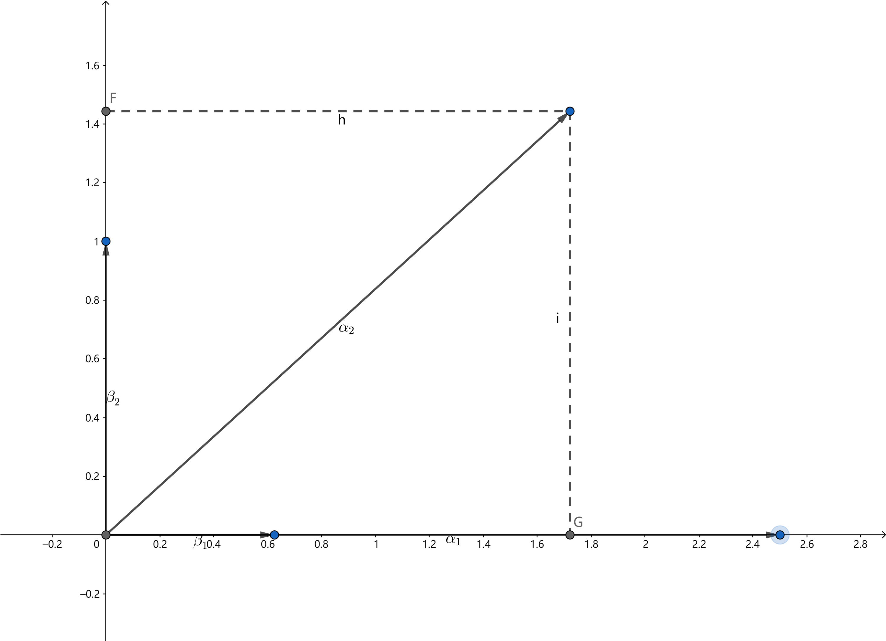
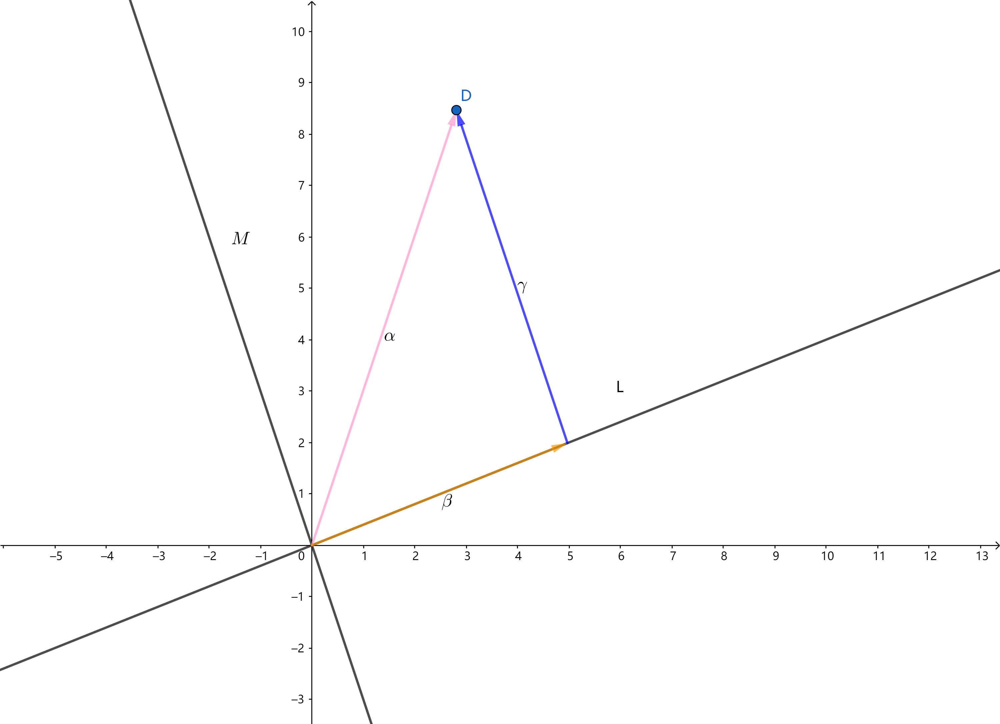

[toc]

# 第三章 矩阵的分解

==本章内容==：

1. 
   $$
   三角分解
   \left\{\begin{array}{ccc}
   上下三角分解（A = LR）&—— &基于高斯消元法 \\
   正交三角分解（A = QR）&—— &基于
   \left\{\begin{array}{c}
   施密特正交化 \\
   \text{Givens}旋转 \\
   \text{Householder}变换
   \end{array}\right.
   \end{array}\right.
   $$
   在正交三角分解中，矩阵$Q$是正交矩阵，$R$是上三角矩阵。由正交三角分解，引出计算矩阵特征值的QR方法。

   Givens旋转和Householder变换数值稳定性比较好，多用于计算。

2. 满秩分解：$A \in C_r^{m \times n} \Longrightarrow A = B \cdot D, (B \in C_r^{m \times r}, D \in C_r^{r \times n})$，分解的方法基于行初等变换。满秩分解的应用有：

   1. 广义逆求解
   2. 最小二乘问题（作为解决该问题的其中一种方法）

3. 谱分解、奇异值分解——基于相似对角化。应用有：

   1. 图谱分析
   2. 独立成分分析
   3. 信号与图像处理

## 第1节 矩阵的三角分解

### 1.1 三角分解的必要性及几个基本概念

1. 上下三角分解的必要性

   对于形如以下形式的线性方程组：
   $$
   \left\{\begin{array}{cccccccc}
   a_{11}x_1 &+ &a_{12}x_2 &+ &\cdots &a_{1n}x_n &= &b_1 \\
   & &a_{22}x_2 &+ &\cdots &a_{2n}x_n &= &b_2 \\
   & & & &\vdots \\
   & & & & & a_{nn}x_n &= &b_n
   \end{array}\right.
   $$
   可按$x_n \to x_{n-1} \to \cdots \to x_1$的顺序依次求解。同理对于线性方程组：
   $$
   \left\{\begin{array}{cccccccc}
   a_{11}x_1 & & & & & &= &b_1 \\
   a_{21}x_1 &+ &a_{22}x_2 & & & &= &b_2 \\
   & & & &\vdots \\
   a_{n1}x_1 &+ &a_{n2}x_2 &+ &\cdots &a_{nn}x_n &= &b_n
   \end{array}\right.
   $$
   可按$x_1 \to x_{2} \to \cdots \to x_n$的顺序依次求解。

   若矩阵$A$可以分解为$A = LR$的形式，则线性方程组$Ax = b$可以写成$LRx = b$，其中$L$是下三角矩阵，$R$是上三角矩阵，令$y = Rx$，则原线性方程组可改写为$Ly = b$，这样的方程组可以轻松求解，当$y$求出来之后，再由方程组$Rx = y$求解出原线性方程组的解。特别地，当方程组的系数矩阵固定不变，方程组的右端项出现变动时，可以先对系数矩阵进行上下三角分解，再应用分解式对不同的右端项构成的线性方程组进行高效地求解。
   $$
   Ax = b \overset{A = LR}{\longleftrightarrow} LRx = b \overset{Rx = y}{\longleftrightarrow} 
   \left\{\begin{array}{ccc}
   Ly = b &\Rightarrow &y \\
   Rx = y & \Rightarrow &x
   \end{array}\right.
   $$
   
2. 正交三角分解的必要性

   同样对于求解线性方程组的问题来说，若矩阵$A$可以分解为$A = UR$的形式，则线性方程组$Ax = b$可以写成$URx = b$，其中$U$是酉矩阵，$U^{-1} = U^T$。令$y = Rx$，则原线性方程组可改写为$Uy = b$，通过$y = U^{T}b$求出$y$之后，再由方程组$Rx = y$求解出原线性方程组的解。
   $$
   Ax = b \overset{A = UR}{\underset{U^HU = E, R为上三角矩阵}{\longrightarrow}} UR = b \to Rx = U^Hb \overset{\tilde{b}=U^Hb}{\longrightarrow} Rx = \tilde{b}
   $$

3. 几个基本概念

==定义1==：
$$
正线上三角矩阵
\Longleftrightarrow
R = \left[\begin{array}{cccc}
a_{11} &a_{12} &\cdots &a_{1n} \\
0 &a_{22} &\cdots &a_{2n} \\
\vdots &\ddots &\cdots &\vdots \\
0 &0 &\cdots &a_{nn}
\end{array}\right], (a_{ii} > 0)
$$

$$
单位上三角矩阵
\Longleftrightarrow
R = \left[\begin{array}{cccc}
1 &a_{12} &\cdots &a_{1n} \\
0 &1 &\cdots &a_{2n} \\
\vdots &\ddots &\cdots &\vdots \\
0 &0 &\cdots &1
\end{array}\right]
$$

==定义2==：
$$
正线下三角矩阵
\Longleftrightarrow
L = \left[\begin{array}{cccc}
a_{11} &0 &\cdots &0 \\
a_{21} &a_{22} &\cdots &0 \\
\vdots &\ddots &\cdots &\vdots \\
a_{n1} &a_{n2} &\cdots &a_{nn}
\end{array}\right], (a_{ii} > 0)
$$

$$
单位下三角矩阵
\Longleftrightarrow
L = \left[\begin{array}{cccc}
1 &0 &\cdots &0 \\
a_{21} &1 &\cdots &0 \\
\vdots &\ddots &\cdots &\vdots \\
a_{n1} &a_{n2} &\cdots &1
\end{array}\right]
$$

4. 几个结论

   （1）上三角矩阵$R$的逆$R^{-1}$也是上三角矩阵，且对角元是$R$对角元的倒数。

   证：由矩阵求逆的初等行变换方法：$[A | E] \to [E | A^{-1}]$，有
   $$
   [R | E] = \left[\begin{array}{cccc|cccc}
   r_{11} &r_{12} &\cdots &r_{1n} &1 &0 &\cdots &0 \\
   &r_{22} &\cdots &r_{2n} &0 &1 &\cdots &0 \\
   & & \vdots & & & &\cdots &  \\
   & & \cdots &r_{nn} &0 &0 &\cdots &1
   \end{array}\right]
   = \left[\begin{array}{cccc|cccc}
   1 &0 &\cdots &0 &\frac{1}{r_{11}} &* &\cdots &* \\
   &1 &\cdots &0 &0 &\frac{1}{r_{22}} &\cdots &* \\
   & & \vdots & & & &\cdots &  \\
   & & \cdots &1 &0 &0 &\cdots &\frac{1}{r_{nn}}
   \end{array}\right]
   $$
   （2）两个上三角矩阵$R_1, R_2$的乘积$R_1R_2$也是上三角矩阵，且对角元是$R_1$与$R_2$对角元的乘积。

   证：
   $$
   R_1 R_2 = \left[\begin{array}{cccc}
   a_{11} &a_{12} &\cdots &a_{1n} \\
   0 &a_{22} &\cdots &a_{2n} \\
   \vdots &\ddots &\cdots &\vdots \\
   0 &0 &\cdots &a_{nn}
   \end{array}\right] 
   \left[\begin{array}{cccc}
   b_{11} &b_{12} &\cdots &b_{1n} \\
   0 &b_{22} &\cdots &b_{2n} \\
   \vdots &\ddots &\cdots &\vdots \\
   0 &0 &\cdots &b_{nn}
   \end{array}\right]
   $$
   将矩阵$R_2$进行按列分块，得$R_2 = [\beta_1, \beta_2, \cdots, \beta_n]$，则$R_1R_2 = [R_1\beta_1, R_1\beta_2, \cdots, R_1\beta_n]$，由于$\beta_i$的后$n-i$个分量为0，相当于进行分块乘法时不考虑$R_1$中的后$n-i$列，因此$R_1R_2$中的第$i$列是$R_1$中前$i$列的线性组合。由于$R_1$是上三角矩阵，$R_1$前$i$行的线性组合中的后$n-i$个分量一定为零，因此$R_1 \beta_i$的后$n-i$个分量一定为零（$i=1,2,\cdots,n$），从而$R_1R_2$是上三角矩阵。再根据矩阵乘法的运算法则，易得$R_1R_2$对角元是$R_1$与$R_2$对角元的乘积。

   （3）酉矩阵$U$的逆$U^{-1}$也是酉矩阵。

   （4）两个酉矩阵之积$U_1U_2$也是酉矩阵。

### 1.2 复习Schmidt正交化

==目标==：$A = (\underset{线性无关}{\underbrace{\alpha_1, \alpha_2, \cdots, \alpha_n}}) \to U = (\underset{标准正交}{\underbrace{\beta_1, \beta_2, \cdots, \beta_n}})$

例：设$(\alpha_1, \alpha_2, \alpha_3)$线性无关。以$\alpha_1$为坐标轴建立直角坐标系，如下图所示（二维直观图示，高维空间可以相应推广）：

令$\beta_1 = \frac{\alpha_1}{\norm{\alpha_1}}$。

先求$\beta_2$，假设$\alpha_2$可由$\beta_1$和$\beta_2$线性表出（即$\beta_2$不能任意选，要选择$\beta_1$与$\beta_2$张成的空间包含$\alpha_2$的那些$\beta_2$），且有$\beta_1 \perp \beta_2$。因此$\alpha_2 = k_{21}\beta_1 + k_{22}\beta_2$，移项得$\alpha_2 - k_{21}\beta_1 = k_{22}\beta_2$。由$\beta_1$与$\beta_2$正交，可知$\beta_1$与$k_{22}\beta_2$正交，即$(k_{22}\beta_2, \beta_1) = (\alpha_2 - k_{21}\beta_1, \beta_1) = (\alpha_2, \beta_1) - k_{21}(\beta_1, \beta_1) = 0$，由于$\beta_1$是单位向量，$(\beta_1, \beta_1) = 1$，从而$k_{21} = (\alpha_2, \beta_1)$。再由$\alpha_2 = k_{21}\beta_1 + k_{22}\beta_2$可得$k_{22}\beta_2 = \alpha_2 - k_{21}\beta_1$，由于$k_{22}\beta_2$与$\beta_2$同方向，将其单位化，即得$\beta_2 = \frac{k_{22}\beta_2}{\norm{k_{22}\beta_2}} = \frac{\alpha_2 - k_{21}\beta_1}{\norm{\alpha_2 - k_{21}\beta_1}} = \frac{\alpha_2 - (\alpha_2, \beta_1)\beta_1}{\norm{\alpha_2 - (\alpha_2, \beta_1)\beta_1}}$。

再求$\beta_3$。同理假设$\alpha_3 = k_{31}\beta_1 + k_{32}\beta_2 + k_{33}\beta_3$，且有$\beta_1 \perp \beta_3, \beta_2 \perp \beta_3$。通过移项得$k_{33}\beta_3 = \alpha_3 - k_{31}\beta_1 - k_{32}\beta_2$，
$$
(k_{33}\beta_3, \beta_1) = (\alpha_3 - k_{31}\beta_1 - k_{32}\beta_2, \beta_1) = (\alpha_3, \beta_1) - k_{31}(\beta_1, \beta_1) - k_{32}(\beta_2, \beta_1) = (\alpha_3, \beta_1) - k_{31}(\beta_1, \beta_1) - 0 \\
(\alpha_3, \beta_1) - k_{31} = 0 \Longrightarrow k_{31} = (\alpha_3, \beta_1)
$$
同理：

$$
(k_{33}\beta_3, \beta_2) = (\alpha_3 - k_{31}\beta_1 - k_{32}\beta_2, \beta_2) = (\alpha_3, \beta_2) - k_{31}(\beta_1, \beta_2) - k_{32}(\beta_2, \beta_2) = (\alpha_3, \beta_2) - 0 - k_{32}(\beta_2, \beta_2) \\
(\alpha_3, \beta_2) - k_{32} = 0 \Longrightarrow k_{32} = (\alpha_3, \beta_2)
$$

从而$k_{33}\beta_3 = \alpha_3 - k_{31}\beta_1 - k_{32}\beta_2 = \alpha_3 - (\alpha_3, \beta_1)\beta_1 - (\alpha_3, \beta_2)\beta_2$，由于$k_{33}\beta_3$与$\beta_3$同方向，将其单位化，即得$\beta_3 = \frac{k_{33}\beta_3}{\norm{k_{33}\beta_3}} = \frac{\alpha_3 - k_{31}\beta_1 - k_{32}\beta_2}{\norm{\alpha_3 - k_{31}\beta_1 - k_{32}\beta_2}} = \frac{\alpha_3 - (\alpha_3, \beta_1)\beta_1 - (\alpha_3, \beta_2)\beta_2}{\norm{\alpha_3 - (\alpha_3, \beta_1)\beta_1 - (\alpha_3, \beta_2)\beta_2}}$。

由数学归纳法，可以证得利用线性无关向量组，构造出一个标准正交向量组的方法（Schmidt正交化方法）：
$$
\beta_1 = \frac{\alpha_1}{\norm{\alpha_1}} \\
\beta_2 = \frac{\alpha_2 - k_{21}\beta_1}{\norm{\alpha_2 - k_{21}\beta_1}} \\
\vdots \\
\beta_i = \frac{\alpha_i - \sum_{j=1}^{i-1}k_{ij}\beta_j}{\norm{\alpha_i - \sum_{j=1}^{i-1}k_{ij}\beta_j}} = \frac{\alpha_i - \sum_{j=1}^{i-1}(\alpha_i, \beta_j)\beta_j}{\norm{\alpha_i - \sum_{j=1}^{i-1}(\alpha_i, \beta_j)\beta_j}}
$$

### 1.3 满秩方阵的QR分解

==定理1==：设$A \in C_n^{n \times n}$，则$A$可==唯一地==分解为$A = UR$。其中$R$是正线上三角复矩阵，$U \in C^{n \times n}$是酉矩阵。或$A$可==唯一地==分解为$A = LV$。其中，$L$是正线下三角复矩阵，$V \in C^{n \times n}$是酉矩阵。

证：$A = (\alpha_1, \alpha_2, \cdots, \alpha_n)$，且$A \in C_n^{n \times n}$，从而$\alpha_1, \alpha_2, \cdots, \alpha_n$线性无关，将其正交化、单位化得：
$$
\beta_1 = \frac{\alpha_1}{\norm{\alpha_1}} \\
\beta_2 = \frac{\alpha_2 - (\alpha_2, \beta_1)\beta_1}{\norm{\alpha_2 - (\alpha_2, \beta_1)\beta_1}} \\
\vdots \\
\beta_i = \frac{\alpha_i - \sum_{j=1}^{i-1}(\alpha_i, \beta_j)\beta_j}{\norm{\alpha_i - \sum_{j=1}^{i-1}(\alpha_i, \beta_j)\beta_j}}
$$
记$k_{ij} = (\alpha_i, \beta_j)$，$k_{11} = \norm{\alpha_1}$或$k_{ii} = \norm{\alpha_i - \sum_{j=1}^{i-1}(\alpha_i, \beta_j)\beta_j}$。则$\alpha_i = \norm{\alpha_i - \sum_{j=1}^{i-1}(\alpha_i, \beta_j)\beta_j}\beta_i + \sum_{j=1}^{i-1}(\alpha_i, \beta_j)\beta_j = k_{ii}\beta_i + \sum_{j=1}^{i-1}k_{ij}\beta_j = \sum_{j=1}^i k_{ij}\beta_j$。从而
$$
A = (\alpha_1, \alpha_2, \cdots, \alpha_n) = (k_{11}\beta_1, k_{21}\beta_1 + k_{22}\beta_2, \cdots, \sum_{j=1}^n k_{nj}\beta_j) \\
= [\beta_1, \beta_2, \cdots, \beta_n]
\left[\begin{array}{cccc}
k_{11} &k_{21} &\cdots &k_{n1} \\
0 &k_{22} &\cdots &k_{n2} \\
\vdots &\ddots &\cdots &\vdots \\
0 &0 &\cdots &k_{nn}
\end{array}\right] = UR
$$
**唯一性**：设$A = U_1R_1 = U_2R_2 \Longrightarrow R_1 = U_1^{-1}U_2R_2 = VR_2$，其中$V$为酉矩阵（由1.1节第4小点的结论可得）。

设$R_1 = \left[\begin{array}{cccc}
k_{11} &k_{21} &\cdots &k_{n1} \\
0 &k_{22} &\cdots &k_{n2} \\
\vdots &\ddots &\cdots &\vdots \\
0 &0 &\cdots &k_{nn}
\end{array}\right]$，$R_2 = \left[\begin{array}{cccc}
l_{11} &l_{21} &\cdots &l_{n1} \\
0 &l_{22} &\cdots &l_{n2} \\
\vdots &\ddots &\cdots &\vdots \\
0 &0 &\cdots &l_{nn}
\end{array}\right]$，$V = \left[\begin{array}{cccc}
v_{11} &v_{12} &\cdots &v_{1n} \\
v_{21} &v_{22} &\cdots &v_{2n} \\
\vdots &\ddots &\cdots &\vdots \\
v_{n1} &v_{n2} &\cdots &v_{nn}
\end{array}\right]$，

$R_1 = VR_2 \Longrightarrow l_{11}v_{11} = k_{11}$，由于$R_1, R_2$是正线上三角矩阵，则$v_{11} = \frac{k_{11}}{l_{11}} > 0$。按照矩阵按列分块乘法的结果，有$l_{11}\left[\begin{array}{c}v_{11} \\ v_{21} \\ \vdots \\ v_{n1} \end{array}\right] = \left[\begin{array}{c}k_{11} \\ 0 \\ \vdots \\ 0 \end{array}\right]$，可得$l_{11}v_{i1} = 0, i = 2, 3, \cdots, n \overset{l_{11} > 0}\longrightarrow v_{i1} = 0, i = 2, 3, \cdots, n$。

由$V = [v_1, v_2, \cdots, v_n]$是酉矩阵，有：
$$
\left[\begin{array}{cccc}
v_1^H v_1 &v_1^H v_2 &\cdots &v_1^H v_n \\
v_2^H v_1 &v_2^H v_2 &\cdots &v_2^H v_n \\
\vdots &\ddots &\cdots &\vdots \\
v_n^H v_1 &v_n^H v_2 &\cdots &v_n^H v_n
\end{array}\right]
= 
\left[\begin{array}{c}
v_1^H \\
v_2^H \\
\vdots \\
v_n^H
\end{array}\right]
[v_1, v_2, \cdots, v_n]
= V^HV \\
= E = 
\left[\begin{array}{cccc}
1 &0 &\cdots &0 \\
0 &1 &\cdots &0 \\
\vdots &\ddots &\cdots &\vdots \\
0 &0 &\cdots &1
\end{array}\right]
$$
即$v_i^Hv_j = \left\{\begin{array}{cc}1, &i = j \\ 0, &i \neq j\end{array}\right.$

根据矩阵对应位置的元素相等，可得$v_1^H v_1 = 1$，而$v_1 = \left[\begin{array}{c}v_{11} \\ v_{21} \\ \vdots \\ v_{n1} \end{array}\right] = \left[\begin{array}{c}v_{11} \\ 0 \\ \vdots \\ 0 \end{array}\right]$，所以有$v_1^H v_1 = v_{11}^2 = 1 \overset{v_{11} > 0}{\longrightarrow} v_{11} = 1$。同理有$0 = v_1^Hv_2 = [v_{11}, v_{21}, \cdots, v_{n1}] \left[\begin{array}{c}v_{12} \\ v_{22} \\ \vdots \\ v_{n2} \end{array}\right] = [1, 0, \cdots, 0] \left[\begin{array}{c}v_{12} \\ v_{22} \\ \vdots \\ v_{n2} \end{array}\right] = v_{12}$。依次类推，可得：
$$
V = \left[\begin{array}{cccc}
1 &0 &\cdots &0 \\
0 &v_{22} &\cdots &v_{2n} \\
\vdots &\ddots &\cdots &\vdots \\
0 &v_{n2} &\cdots &v_{nn}
\end{array}\right]
$$
继续由$R_1 = VR_2 \Longrightarrow l_{22}v_{22} = k_{22}$，对$V$中右下角的$n-1$阶方阵递归地重复上述操作，最终可得$V =U_1^{-1}U_2 = E_n$，从而$U_1 = U_2$，$R_1 = VR_2 = R_2$。证毕！

设$A \in C_n^{n \times n}$，$A^T \in C_n^{n \times n} \Longrightarrow A^T = U_1R_1 \Longrightarrow A = (A^T)^T = (U_1R_1)^T = R_1^T U_1^T = LV$。

例1：求三阶实矩阵$A = \left[\begin{array}{ccc}
1 &0 &2 \\ 1 &1 &0 \\ 1 &2 &3
\end{array}\right]$的QR分解。

解：$A = (\alpha_1, \alpha_2, \alpha_3)$。

$\alpha_1 = [1, 1, 1]^T $ $\Longrightarrow$ $k_{11} = \sqrt{3}$ $\Longrightarrow$ $\beta_1 = \frac{\alpha_1}{\norm{\alpha_1}} = \frac{1}{\sqrt{3}}(1, 1, 1)^T$ $\Longrightarrow$ $k_{21} = (\alpha_2, \beta_1) = \sqrt{3}$。

$\alpha_2 - k_{21}\beta_1 = (-1, 0, 1)^T$ $\Longrightarrow$ $k_{22} = \norm{\alpha_2 - k_{21}\beta_1} = \sqrt{2}$ $\Longrightarrow$ $\beta_2 = \frac{\alpha_2 - k_{21}\beta_1}{\norm{\alpha_2 - k_{21}\beta_1}} = \frac{1}{\sqrt{2}}(-1, 0, 1)^T$ $\Longrightarrow$ $k_{31} = (\alpha_3, \beta_1) = \frac{5}{\sqrt{3}}, k_{32} = (\alpha_3, \beta_2) = \frac{1}{\sqrt{2}}$。

$\alpha_3 - k_{31}\beta_1 - k_{32}\beta_2 = \frac{5}{6}(1, -2, 1)^T$ $\Longrightarrow$ $k_{33} = \norm{\alpha_3 - k_{31}\beta_1 - k_{32}\beta_2} = \frac{5}{\sqrt{6}}$ $\Longrightarrow$ $\beta_3 = \frac{\alpha_3 - k_{31}\beta_1 - k_{32}\beta_2}{\norm{\alpha_3 - k_{31}\beta_1 - k_{32}\beta_2}} = \frac{1}{\sqrt{6}}(1, -2, 1)^T$。

从而$A = (\alpha_1, \alpha_2, \alpha_3) = (\beta_1, \beta_2, \beta_3)\left[\begin{array}{ccc}
\sqrt{3} &\sqrt{3} &\frac{5}{\sqrt{3}} \\ 0 &\sqrt{2} &\frac{1}{\sqrt{2}} \\ 0 &0 &\frac{5}{\sqrt{6}}
\end{array}\right] = QR$。

==推论1==：设$A$是正定Hermite矩阵，则存在唯一的正线上三角复矩阵$R$，使得$A = R^H R$。

证：$A$是正定Hermite矩阵$\Longrightarrow$$A = P^HP$（P可逆，且不唯一）$\Longrightarrow$$P = UR$ $\Longrightarrow$ $A = R^HU^HUR$ $\Longrightarrow$ $A = R^H R$。

**唯一性**：$A = R_1^H R_1 = R_2^H R_2$ $\Longrightarrow$ $(R_1^H)^{-1}R_2^H = R_1(R_2)^{-1} = E_n$ $\Longrightarrow$ $R_1 = R_2$。（$R_1^HR_1 = R_2^HR_2$，$R_1, R_2$是正线上三角矩阵，由1.1节第2小点的结论可得$r_{ii}^1 = r_{ii}^2$，再由$(R_1^H)^{-1}R_2^H = R_1(R_2)^{-1}$和1.1节第1、2小点可知$r_{ii}^1 = r_{ii}^2 = 1$，同时等式左边为下三角矩阵，右边为上三角矩阵，最终得到$(R_1^H)^{-1}R_2^H = R_1(R_2)^{-1} = E_n$）

==推论2==：设$A$是实对称正定矩阵，则存在唯一的正线上三角实矩阵$R$，使$A = R^T R$。

例2：设$A = \left[\begin{array}{cc}
0 &1 \\ 1 &0
\end{array}\right]$，$\det A = -1 \neq 0$ $\Longrightarrow$ $A \in C_2^{2 \times 2}$ $\Longrightarrow$ $A = QR$。

若$A = LR$成立，则：
$$
\left[\begin{array}{cc}
0 &1 \\ 1 &0
\end{array}\right]
=
\left[\begin{array}{cc}
l_{11} &0 \\ l_{21} &l_{22}
\end{array}\right]
\left[\begin{array}{cc}
r_{11} &r_{12} \\ 0 &r_{22}
\end{array}\right]
=
\left[\begin{array}{cc}
l_{11}r_{11} &l_{22}r_{12} \\ l_{21}r_{11} &l_{21}r_{12} + l_{22}r_{22}
\end{array}\right]
$$
根据矩阵对应分量相等，有$l_{11}r_{11} = 0$ $\Longrightarrow$ $l_{11} = 0$或$r_{11} = 0$。不妨设$l_{11} = 0$ $\Longrightarrow$ $\det L = 0$ $\Longrightarrow$ $\det (LR) = \det(L) \cdot \det(R) = 0 \neq -1 = \det A$（矛盾），因此$A \neq LR$。==矩阵可逆不能保证可以对矩阵进行上下三角分解==。实际上，矩阵可以进行上下三角分解需要矩阵的各阶顺序主子式不等于0。

==定理2==：设$A \in C_n^{n \times n}$，$L$（$\tilde{L}$）为（单位）下三角复矩阵，$R$（$\tilde{R}$）为（单位）上三角复矩阵，$D$为对角阵，则下列命题等价：

（1）$\Delta_k = \left|\begin{array}{cccc}
a_{11} &a_{12} &\cdots &a_{1k} \\
a_{21} &a_{22} &\cdots &a_{2k} \\
\vdots &\ddots &\cdots &\vdots \\
a_{k1} &a_{k2} &\cdots &a_{kk}
\end{array}\right| \neq 0, k = 1, \cdots ,n$（$A$的各阶顺序主子式不等于0）

（2）$A$可==唯一地==分解为$A = L\tilde{R}, l_{ii} \neq 0 (\forall_i)$

（3）$A$可==唯一地==分解为$A = \tilde{L}R, r_{ii} \neq 0 (\forall_i)$

（4）$A$可==唯一地==分解为$A = \tilde{L}D\tilde{R}, d_{ii} \neq 0 (\forall_i)$

证：

（1）$\Longrightarrow$（2）数学归纳法：

1. $A$为一阶方阵 $\Longrightarrow$ $A = L \tilde{R}$；

2. 当$A$为$n-1$阶方阵时，假设$A = L_1\tilde{R_1}$成立；

3. 当$A$为$n$阶方阵时，由于$\Delta_{n-1} \neq 0$，$A_{n-1}$可逆：
   $$
   A = \left[\begin{array}{cc}
   A_{n-1} &\beta \\ \alpha &a_{nn}
   \end{array}\right]
   \Longrightarrow
   \left[\begin{array}{cc}
   A_{n-1} &\beta \\ \alpha &a_{nn}
   \end{array}\right] 
   \left[\begin{array}{cc}
   E_{n-1} &-A_{n-1}^{-1}\beta \\ 0 &1
   \end{array}\right] 
   = \left[\begin{array}{cc}
   A_{n-1} &0 \\ \alpha &a_{nn} - \alpha A_{n-1}^{-1}\beta
   \end{array}\right] \\
   \Longrightarrow
   A = \left[\begin{array}{cc}
   A_{n-1} &0 \\ \alpha &a_{nn} - \alpha A_{n-1}^{-1}\beta
   \end{array}\right]
   \left[\begin{array}{cc}
   E_{n-1} &A_{n-1}^{-1}\beta \\ 0 &1
   \end{array}\right] \\
   \Longrightarrow
   A = \left[\begin{array}{cc}
   L_1\tilde{R_1} &0 \\ \alpha &a_{nn} - \alpha A_{n-1}^{-1}\beta
   \end{array}\right]
   \left[\begin{array}{cc}
   E_{n-1} &A_{n-1}^{-1}\beta \\ 0 &1
   \end{array}\right] \\
   = \left[\begin{array}{cc}
   L_1 &0 \\ \alpha(\tilde{R_1})^{-1} &a_{nn} - \alpha A_{n-1}^{-1}\beta
   \end{array}\right]
   \left[\begin{array}{cc}
   \tilde{R_1} &0 \\ 0 &1
   \end{array}\right]
   \left[\begin{array}{cc}
   E_{n-1} &A_{n-1}^{-1}\beta \\ 0 &1
   \end{array}\right] \\
   \left[\begin{array}{cc}
   L_1 &0 \\ \alpha(\tilde{R_1})^{-1} &a_{nn} - \alpha A_{n-1}^{-1}\beta
   \end{array}\right]
   \left[\begin{array}{cc}
   \tilde{R_1} &\tilde{R_1}A_{n-1}^{-1}\beta \\ 0 &1
   \end{array}\right] = L\tilde{R}
   $$
   **唯一性**：设$A = L_1 \tilde{R_1} = L_2 \tilde{R_2}$，等式两边同时左乘$L_{1}^{-1}$和$(\tilde{R_{2}})^{-1}$得$L_1^{-1}L_2 = \tilde{R_1}(\tilde{R_2})^{-1}$，由1.1节第1、2小点的结论可得$L_{1}^{-1}L_2 = L, \tilde{R_1}(\tilde{R_2})^{-1} = R$，其中$L$是正线下三角矩阵，$R$是单位上三角矩阵，根据矩阵相等对应位置元素相等，可得$L_1^{-1}L_2 = \tilde{R_1}(\tilde{R_2})^{-1} = E$，从而$L_1 = L_2, \tilde{R_1} = (\tilde{R_2})^{-1}$。

（2）$\Longrightarrow$（1）：

$A = L\tilde{R}$且$l_{ii} \neq 0 (\forall_i)$，将$A$，$L$和$\tilde{R}$对进行对应的分块，使得$A_{11}$是$k$阶方阵：
$$
A = \left[\begin{array}{cc}
A_{11} &A_{12} \\ A_{21} &A_{22}
\end{array}\right]
= \left[\begin{array}{cc}
L_{11} &0 \\ L_{21} &L_{22}
\end{array}\right]
\left[\begin{array}{cc}
\tilde{R_{11}} &\tilde{R_{12}} \\ 0 &\tilde{R_{22}}
\end{array}\right]
= \left[\begin{array}{cc}
L_{11}\tilde{R_{11}} &L_{11}\tilde{R_{12}} \\ L_{21}\tilde{R_{11}} &L_{21}\tilde{R_{12}} + L_{22}\tilde{R_{22}}
\end{array}\right]
$$
$A_{11} = L_{11}\tilde{R_{11}}$ $\Longrightarrow$ $\Delta_k = |A_{11}| = |L_{11}||\tilde{R_{11}}| = |L_{11}| = l_{11}l_{22} \cdots l_{kk} \neq 0$。

（2）$\Longrightarrow$（4）：
$$
\Longleftrightarrow
L = \left[\begin{array}{cccc}
l_{11} &0 &\cdots &0 \\
l_{21} &l_{22} &\cdots &0 \\
\vdots &\ddots &\cdots &\vdots \\
l_{n1} &l_{n2} &\cdots &l_{nn}
\end{array}\right]
=  \left[\begin{array}{cccc}
1 &0 &\cdots &0 \\
\frac{l_{21}}{l_{11}} &1 &\cdots &0 \\
\vdots &\ddots &\cdots &\vdots \\
\frac{l_{n1}}{l_{11}} &\frac{l_{n2}}{l_{22}} &\cdots &1
\end{array}\right]
 \left[\begin{array}{cccc}
l_{11} &0 &\cdots &0 \\
0 &l_{22} &\cdots &0 \\
\vdots &\ddots &\cdots &\vdots \\
0 &0 &\cdots &l_{nn}
\end{array}\right] \\
= \tilde{L}D \Longrightarrow A = L\tilde{R} = \tilde{L}D\tilde{R}
$$
（4）$\Longrightarrow$（2）：$A = \tilde{L}D\tilde{R} \Longrightarrow A = L\tilde{R}$。

### 1.4 任意矩阵的QR分解

==定义1==：设$A$为$m \times n$复（实）矩阵，如果$\rank(A) = m$，则称$A$为行满秩矩阵，记为$A \in C_m^{m\times n}(R_m^{m\times n})$。如果$\rank(A) = n$，则称$A$为列满秩矩阵，记为$A \in C_n^{m \times n}(R_n^{m \times n})$。

==定理1==：若$A$为行满秩矩阵或列满秩矩阵，则：

（1）设$A \in C_m^{m \times n}$，则存在$n$阶酉矩阵$V$及$m$阶正线下三角复矩阵$L$，使得$A = [L, 0]V$。

**分析**：$A = [L, 0]V = \left[\begin{array}{c|c}L &0\end{array}\right] \left[\begin{array}{c}V_1 \\ \hline V_2\end{array}\right] = LV_1$，其中[L, 0]非方阵，$V$是方阵，$A= LV_1 + 0V_2 = LV_1$非方阵，$V_1$中的列向量不再正交，行向量保持正交性。

证：$A \in C_m^{m \times n}$ $\Longrightarrow$ $A = \left[\begin{array}{c}a_1 \\ a_2 \\ \vdots \\ a_m\end{array}\right]$ $\Longrightarrow$ $a_1, a_2, \cdots, a_m$线性无关 $\overset{扩充}{\Longrightarrow}$ $a_1, a_2, \cdots, a_m, a_{m+1}, \cdots, a_n$线性无关 $\Longrightarrow$ $A^\prime = \left[\begin{array}{c}a_1 \\ \vdots \\ a_m \\ \hline a_{m+1} \\ \vdots \\ a_n \end{array}\right]$是满秩方阵。
$$
\left[\begin{array}{c}A \\ \hline a_{m+1} \\ \vdots \\ a_n \end{array}\right] = A^\prime
= \left[\begin{array}{c}a_1 \\ \vdots \\ a_m \\ \hline a_{m+1} \\ \vdots \\ a_n \end{array}\right]
= \left[\begin{array}{cccc|ccc}
k_{11} & & & &0 &\cdots & 0 \\
k_{21} &k_{22} & & &\vdots & &\vdots \\
\vdots &\cdots &\ddots & &\vdots & &\vdots \\
k_{m1} &k_{m2} &\cdots &k_{mm} &0 &\cdots &0 \\
\hline
k_{m+1, 1} &k_{m+2,2} &\cdots &k_{m+1, m} &k_{m+1, m+1} & & \\
\vdots &\vdots & &\vdots &\vdots &\ddots & \\
k_{n1} &k_{n2} &\cdots &k_{nn} &k_{n, m+1} &\cdots &k_{nn}
\end{array}\right]
\left[\begin{array}{c}\beta_1 \\ \beta_2 \\ \vdots \\ \beta_n\end{array}\right] \\
\Longrightarrow
A = \left[\begin{array}{ccccccc}
k_{11} & & & &0 &\cdots & 0 \\
k_{21} &k_{22} & & &\vdots & &\vdots \\
\vdots &\cdots &\ddots & &\vdots & &\vdots \\
k_{m1} &k_{m2} &\cdots &k_{mm} &0 &\cdots &0 \\
\end{array}\right]
\left[\begin{array}{c}\beta_1 \\ \beta_2 \\ \vdots \\ \beta_n\end{array}\right]  = [L, 0]V
$$
（2）设$A \in C_n^{m \times n}$，则存在$m$阶酉矩阵$U$及$n$阶正线上三角复矩阵$R$，使得$A = U\left[ \begin{array}{c} R \\ 0\end{array}\right]$。

证：$A^T \in C_n^{n \times m}$ $\Longrightarrow$ $A^T = [L, 0]V$ $\Longrightarrow$ $A = (A^T)^T = ([L, 0]V)^T = V^T \left[\begin{array}{c}L^T \\ 0^T\end{array}\right] = U\left[ \begin{array}{c} R \\ 0\end{array}\right]$。

==定理2==：

（1）设$A \in C_n^{m \times n}$，则$A$可以==唯一地==分解为$A = UR$，其中$R$是$n$阶正线上三角矩阵，$U \in U_n^{m \times n}$（记号$U \in U_n^{m \times n}$表示矩阵$U$的列向量标准正交）。

证：$A \in C_n^{m \times n}$ $\Longrightarrow$ 对$\forall_x \neq 0$，有$Ax \neq 0$（列向量线性无关） $\Longrightarrow$ $x^HA^HAx = (Ax)^H (Ax) > 0$ $\Longrightarrow$ $A^HA$为正定Hermite矩阵 $\Longrightarrow$ $A^HA = R^HR$ $\Longrightarrow$ 等式两边同时左乘$(R^H)^{-1}$和右乘$R^{-1}$，得$E = (R^H)^{-1}A^HAR^{-1} = (R^{-1})^H A^H A R^{-1} = (AR^{-1})^H(AR^{-1})$。

令$U = AR^{-1}$，则$A = UR$且$U^H U = E$。

**唯一性**：$A = U_1 R_1 = U_2 R_2$ $\Longrightarrow$ $A^HA = R_1^HU_1^H U_1R_1 = R_1^HR_1 = R_2^HR_2$ $\Longrightarrow$ $(R_1^H)^{-1}R_2^H = R_1 (R_2)^{-1} = E_n$ $\Longrightarrow$ $R_1 = R_2$ $\Longrightarrow$ $U_1 = U_2$。（$R_1^HR_1 = R_2^HR_2$，$R_1, R_2$是正线上三角矩阵，由1.1节第2小点的结论可得$r_{ii}^1 = r_{ii}^2$，再由$(R_1^H)^{-1}R_2^H = R_1(R_2)^{-1}$和1.1节第1、2小点可知$r_{ii}^1 = r_{ii}^2 = 1$，同时等式左边为下三角矩阵，右边为上三角矩阵，最终得到$(R_1^H)^{-1}R_2^H = R_1(R_2)^{-1} = E_n$）

（2）设$A \in C_m^{m \times n}$，则$A$可唯一地分解为$A = LV$，其中$L$是$m$阶正线下三角矩阵，$V \in U_m^{m \times n}$。

证：$A^T \in C_m^{n \times m}$， $\Longrightarrow$ $A^T = UR$ $\Longrightarrow$ $A = (A^T)^T = (UR)^T = R^TU^T = LV$，其中$L$是$m$阶正线下三角矩阵，$V \in U_m^{m \times n}$。

**进一步去掉满秩的限制，考虑一般矩阵的QR分解**

==定理3==：设$A \in C_r^{m \times n}$，则存在酉矩阵$U \in U^{m \times m}$和$V \in U^{n \times n}$及$r$阶正线下三角矩阵$L$，使得$A = U \left[\begin{array}{cc}L &0 \\ 0 &0\end{array}\right] V$。

证：$A \in C_r^{m \times n}$ $\Longrightarrow$ $AP = [\alpha_1, \alpha_2, \cdots, \alpha_r, \alpha_{r+1}, \cdots, \alpha_n]$，其中$\alpha_1, \alpha_2, \cdots, \alpha_r$线性无关 $\Longrightarrow$ $[\alpha_{r+1}, \alpha_{r+2}, \cdots, \alpha_n] = [\alpha_1, \alpha_2, \cdots, \alpha_r]C$ $\Longrightarrow$ $AP = [\alpha_1, \alpha_2, \cdots, \alpha_r][E_r, C] = U\left[\begin{array}{c}R \\ 0\end{array}\right][E_r, C] = U \left[\begin{array}{cc}R &RC \\ 0 &0\end{array}\right]$，

令$B = [R, RC] \in C_r^{r \times n}$ $\Longrightarrow$ $B = [R, RC] = [L, 0]V^\prime$ $\Longrightarrow$ 
$$
A = U \left[\begin{array}{cc}
R &RC \\ 0 &0\end{array}\right]
P^{-1} = U\left[\begin{array}{c}
[L, 0]V^\prime \\ 0
\end{array}\right]P^{-1} \\
= U\left[\begin{array}{c}
[L, 0]V^\prime \\ 0V^\prime
\end{array}\right]P^{-1}
= U\left[\begin{array}{cc}
L &0 \\ 0 &0
\end{array}\right]V^\prime P^{-1} \\
= U\left[\begin{array}{cc}
L &0 \\ 0 &0
\end{array}\right]V
$$
其中$V = V^\prime P^{-1}$。

设$A \in C_r^{n \times m}$，$A^T \in C_r^{m \times n}$ $\Longrightarrow$ $A^T = U_1 \left[\begin{array}{cc}L &0 \\ 0 &0\end{array}\right] V_1$, $A = (A^T)^T = (U_1 \left[\begin{array}{cc}L &0 \\ 0 &0\end{array}\right] V_1)^T = V_1^T \left[\begin{array}{cc}L^T &0^T \\ 0^T &0^T\end{array}\right] U_1^T = U \left[\begin{array}{cc}R &0 \\ 0 &0\end{array}\right] V$。

## 第2节 矩阵的谱分解

### 2.1 投影

1. 投影的概念

   设$L < V_n(C), M < V_n(C)$（$L$和$M$是$V_n(C)$的子空间），$L \oplus M = V_n(C)$是直和 $\Longleftrightarrow$ $\forall_\alpha \in V_n(C), \alpha = \beta + \gamma$，其中$\beta \in L, \gamma \in M$是唯一的。

   对于$\forall_{\alpha} \in V_n(C)$，$\alpha$与$\beta, \gamma$分别建立了一一对应关系。

   

   $\forall_\alpha \in V_n(C)$，$\alpha \overset{P_{LM}}{\Longrightarrow} \beta \in L$，记$\beta = P_{LM}\alpha$为$\alpha$沿着$M$到$L$的投影。

   $P_{LM}\alpha = \beta, P_{LM}\beta = \beta$ $\Longrightarrow$ $P_{LM} \alpha = \beta = P_{LM}\beta = P_{LM}P_{LM}\alpha = P_{LM}^2\alpha$ $\Longrightarrow$ $P_{LM} = P_{LM}^2$，即投影变换是幂等算子。

2. 投影变换为线性变换

   $\forall_{\alpha_1, \alpha_2, \alpha} \in V, k \in C$，则：

   （1）$P_{LM}(\alpha_1 + \alpha_2) = P_{LM}\alpha_1 + P_{LM}\alpha_2$；

   （2）$P_{LM}(k\alpha) = kP_{LM}\alpha$。

   证：设$L < V, M < V, L \oplus M = V$。$\forall_{\alpha_1, \alpha_2, \alpha} \in V$，$\alpha_1 = \beta_1 + \gamma_1, \alpha_2 = \beta_2 + \gamma_2, \alpha = \beta + \gamma$，其中$\beta_1, \beta_2, \beta \in L, \gamma_1, \gamma_2, \gamma \in M$。

   （1）根据定义有$P_{LM}\alpha_1 = \beta_1, P_{LM}\alpha_2 = \beta_2$，$\alpha_1 + \alpha_2 = (\beta_1 + \beta_2) + (\gamma_1 + \gamma_2)$，其中$\beta_1 + \beta_2 \in L, \gamma_1 + \gamma_2 \in M$，可得$P_{LM}(\alpha_1 + \alpha_2) = \beta_1 + \beta_2$，从而$P_{LM}(\alpha_1 + \alpha_2) = P_{LM}\alpha_1 + P_{LM}\alpha_2$。

   （2）根据定义有$P_{LM}\alpha = \beta$，$k\alpha = k\beta + k\gamma$，其中$k\beta \in L, k\gamma \in M$，则$P_{LM}(k\alpha) = k\beta$，从而$P_{LM}(k\alpha) = kP_{LM}\alpha$。

3. 投影变换与投影矩阵

   设$\epsilon_1, \epsilon_2, \cdots, \epsilon_n$是空间$V$的一组基，根据第一章第三节关于线性变换与矩阵的知识可知：
   $$
   [\epsilon_1, \epsilon_2, \cdots, \epsilon_n]A = P_{LM}(\epsilon_1, \epsilon_2, \cdots, \epsilon_n) = P_{LM}^2(\epsilon_1, \epsilon_2, \cdots, \epsilon_n) \\
   = P_{LM}[P_{LM}(\epsilon_1, \epsilon_2, \cdots, \epsilon_n)] = P_{LM}([\epsilon_1, \epsilon_2, \cdots, \epsilon_n]A) \\
   = [P_{LM}(\epsilon_1, \epsilon_2, \cdots, \epsilon_n)]A = [\epsilon_1, \epsilon_2, \cdots, \epsilon_n]A \cdot A \\
   = [\epsilon_1, \epsilon_2, \cdots, \epsilon_n]A^2 \\ \Longrightarrow A = A^2
   $$

4. 正交投影与矩阵

   设$V_n(C) = L \oplus M$，$\forall_{\alpha} \in V_n(C)$，$\alpha = \beta + \gamma$，其中$\beta \in L, \gamma \in M$，且$\beta \perp \gamma$（$\Longleftrightarrow (\beta, \gamma) = 0$），则称$\beta$为$\alpha$的正交投影。
   $$
   0 = (\beta, \gamma) = (P\alpha, \alpha - P\alpha) \Longleftrightarrow 0 = (Ax, x - Ax) = (Ax, (E-A)x) \\
   \Longleftrightarrow x^HA^H(E-A)x = 0 \overset{x的任意性}{\Longleftrightarrow} A^H(E-A)=0 \\
   \Longleftrightarrow A^H = A^HA \Longrightarrow A = (A^H)^H = (A^HA)^H = A^HA \\
   \Longrightarrow
   \left\{\begin{array}{ccc}
   A^H &= &A^HA \\
   A &= &A^HA
   \end{array}\right.
   \Longrightarrow A^H = A
   $$

5. 投影的应用

   $\underset{x = s + v}{\overset{待滤波的数据}{\longrightarrow}} \framebox{P} \longrightarrow 估计数据\hat{s}$，滤波算子$P$的基本要求：

   （1）$P$必须是一线性算子；

   （2）$PP\alpha = P\alpha = \beta$ $\Longrightarrow$ $P$必须是幂等算子；

   （3）$[\alpha - P\alpha] \perp P\alpha$ $\Longrightarrow$ $<(I-P)\alpha, P\alpha> = \alpha^H (I-P^H) P\alpha = 0$ $\overset{\alpha的任意性}{\Longrightarrow}$ $P - P^HP = 0$ $\Longrightarrow P^H = P$。

6. 值域与核（空间）

   （1）设$A \in C^{m \times n}$，则：

   $R(A) = \{y | y = Ax, \forall_x \in C^n\}$——$A$的值域；

   $N(A) = \{x|Ax = 0, \forall_x \in C^n\}$——$A$的核（空间）。

   （2）设$A \in C^{n \times m}, B \in C^{n \times s}$，$R(A) \perp R(B)$ $\Longleftrightarrow$ $A^H B = 0$。

   证：$R(A) \perp R(B)$ $\Longleftrightarrow$ $\forall_\alpha \in R(A), \forall_\beta \in R(B), \alpha \perp \beta$（或$(\alpha, \beta) = 0$），$\alpha \in R(A), \beta \in R(B)$ $\Longrightarrow$ $\alpha = \sum_{i=1}^m x_i \alpha_i = Ax, \beta = \sum_{i=1}^s y_i \beta_i = By$，$(\alpha, \beta) = 0$ $\Longleftrightarrow \alpha^H \beta = 0$ $(Ax)^HBy = 0$ $x^HA^H By = 0$ $\Longleftrightarrow$ $A^HB = 0$。

   （3）设$A \in C^{m \times n}$，则$\dim R(A) + \dim N(A^H) = m$。

   设$\rank(A) = r, R(A) = L(\alpha_1, \alpha_2, \cdots, \alpha_n)$ $\Longrightarrow$ $\dim R(A) = \rank (\alpha_1, \alpha_2, \cdots, \alpha_n) = \rank(A) = r$，$\rank(A^H) = \rank(A) = r, A^H  \in C^{n \times m}$ $\Longrightarrow$ $\dim N(A^H) = m-r$, $\dim R(A) + \dim N(A^H) = m$。

   （4）设$A \in C^{m \times n}$，则$\left\{\begin{array}{c}R(A) \perp N(A^H) \\ N(A) \perp R(A^H)\end{array}\right.$

   证：$\forall_x \in N(A^H)$ $\Longleftrightarrow$ $A^H x = 0$，$\forall_y \in R(A)$ $\Longrightarrow$ 存在$z$，使得$y = Az$。$(x, y) = x^H y = x^H Az = (A^H x)^H z = 0$，$(x, y) = 0$ $\Longleftrightarrow$ $R(A) \perp N(A^H)$。

   （5）设$A \in C^{m \times n}$，则$R(A) \oplus N(A^H) = C^m$。

   证：$\forall_x \in R(A) \cap N(A^H)$ $\Longleftrightarrow$ $x \in R(A)$且$x \in N(A^H)$，$R(A) \perp N(A^H)$ $\Longrightarrow$ $(x, x) = 0$ $\Longleftrightarrow$ $x = 0$ $\Longrightarrow$ $R(A) \oplus N(A^H)$。

   $R(A) \subset C^m, N(A^H) \subset C^m$ $\Longrightarrow$ $R(A) \oplus N(A^H) \subset C^m$，又$\dim R(A) + \dim N(A^H) = m$，故$R(A) \oplus N(A^H) = C^m$。

   （6）基本结论：
   $$
   A \in C^{m \times n} \Longrightarrow
   \left\{\begin{array}{ccc}
   \dim R(A) + \dim N(A^H) &= &m \\
   \dim R(A^H) + \dim N(A) &= &n \\
   C^m &= &R(A) \oplus N(A^H) \\
   C^n &= &R(A^H) \oplus N(A)
   \end{array}\right.
   $$

7. 幂等矩阵的性质

   设$A \in C^{n \times n}$：
   $$
   A = A^2 \Longrightarrow
   \left\{\begin{array}{cc}
   (1) &A^H = (A^H)^2, E- A = (E-A)^2 \\
   (2) &\sigma(A) = \{\lambda | Ax = \lambda x, x \neq 0\} = \{0, 1\} \\
   (3) &\rank(A) = \tr(A) \\
   (4) &A(E-A) = (E-A)A = 0 \\
   (5) &A\alpha = \alpha \Longleftrightarrow \alpha \in R(A) \\
   (6) &N(A) = R(E-A), R(A) = N(E-A)
   \end{array}\right.
   $$
   ==说明==：

   $Ax = \lambda x, x \neq 0$ $\Longrightarrow$ $A^2 x = AAx = \lambda Ax = \lambda^2 x$ $\Longrightarrow$ $A^2x = \lambda^2 x, x \neq 0$，即$\lambda^2$是$A^2$的特征值。又$A^2 = AA = A$，则$A^2 x = (\lambda^2 x = \lambda x) = A x$，从而$(\lambda^2-\lambda)x = 0, x \neq 0$ $\Longrightarrow$ $\lambda = 0$或$\lambda = 1$。

   设$\rank(A) = r$ $\Longleftrightarrow$ $A$的列秩$=r$, $A$有$r$个列向量构成的列向量组的最大无关组（不妨设其前$r$个列$\alpha_1, \alpha_2, \cdots, \alpha_r$）。$A^2 = A$ $\Longleftrightarrow$ $A \cdot A = A$ $\Longleftrightarrow$ $A[\alpha_1, \alpha_2, \cdots \alpha_n] = [\alpha_1, \alpha_2, \cdots, \alpha_n]$ $\Longrightarrow$ $A\alpha_i = \alpha_i = 1 \cdot \alpha_i, (i = 1, 2, \cdots, r)$且$\alpha_1, \alpha_2, \cdots, \alpha_r$线性无关。

   $\rank(A) = r$ $\Longrightarrow$ $Ax = 0$共有$n - r$个线性无关解（设为$\xi_{r+1}, \cdots \xi_n$），即$A\xi_i = 0 = 0 \cdot \xi_i (i = r+1, \cdots, n)$ $\Longrightarrow$ $A$有特征值为0，对应线性无关的特征向量为$\xi_{r + 1}, \cdots, \xi_n$ $\Longrightarrow$ $A$有$n$个线性无关的特征向量$\alpha_1, \alpha_2, \cdots, \alpha_r, \xi_{r+1}, \cdots, \xi_n$，从而矩阵$A$可相似对角化。令$P = [\alpha_1, \alpha_2, \cdots, \alpha_r, \xi_{r+1}, \cdots, \xi_n]$，则$P^{-1}AP = \left[\begin{array}{cc}E_r &0 \\ 0 &0\end{array}\right]$，从而$\rank(A) = r = \tr(A)$（初等行列变换不改变矩阵的秩）。

8. 设($A \in C^{n \times n}, A = A^2$ $\Longrightarrow$ $A = A^H$) $\Longleftrightarrow$ $C^n = R(A) \oplus N(A), R^\perp(A) = N(A)$。

### 2.2 单纯矩阵的谱分解

==定义1（代数重数）==：$|\lambda E - A| = (\lambda - \lambda_1)^{r_1} \cdots (\lambda - \lambda_i)^{r_i} \cdots (\lambda - \lambda_k)^{r_k}$，其中$\sum_{i=1}^k r_i = n$。称$r_i$为$\lambda_i$的代数重数。

==定义2（几何重数）==：$V_{\lambda_i} = \{x | (\lambda_i E - A) x = 0\}$，$m_i = \dim V_{\lambda_i}$（$m_i = n - \rank(\lambda_i E - A)$）称为$\lambda_i$的几何重数。

==定义3==：若矩阵$A$的每个特征值的代数重数等于几何重数，则称$A$为单纯矩阵。

$A$为单纯矩阵 $\Longleftrightarrow$ $A$可相似对角化

==定理1==：设$A \in C^{n \times n}$是单纯矩阵，则：
$$
A = \sum_{i=1}^n \lambda_i A_i 
\left\{\begin{array}{cc}
(1) &\lambda_i \in \lambda(A) = \{\lambda| Ax = \lambda x, x \neq 0\}(A的谱) \\
(2) &A_i满足\left\{\begin{array}{c}
幂等性 &A_i^2 = A_i \\
分离性 &A_i A_j = 0, (i \neq j) \\
可加性 &\sum_{i=1}^n A_i = E_n = PP^{-1} = P^{-1}P
\end{array}\right.
\end{array}\right.
$$
证：

$A$是单纯矩阵 $\Longrightarrow$ $A$有$n$个线性无关的特征向量$x_1, x_2, \cdots, x_n$，且$Ax_i = \lambda_i x_i, (i=1,2,\cdots,n)$。令$P = [x_1, x_2, \cdots, x_n]$，$D = \left[\begin{array}{cccc}\lambda_1 &0 &\cdots &0 \\ 0 &\lambda_2 &\cdots &0 \\ \vdots &\cdots &\ddots &\vdots \\ 0 &0 &\cdots &\lambda_n \end{array}\right]$，则$AP = PD $$\Longleftrightarrow$ $A = PDP^{-1}$ $\Longrightarrow$ $A^T = (P^{-1})^TD^TP^T = (P^T)^{-1}DP^T$ ==(1)==

设$y_1, y_2, \cdots, y_n$为$A^T$的$n$个线性无关的特征向量，即$A^T y_i = \lambda_i y_i, (i=1,2,\cdots,n)$ $\Longleftrightarrow$ $y_i^T A = \lambda_i y_i^T$（左特征值和左特征向量） ==(2)==。

$A^T = (P^T)^{-1}DP^T$ ==(1)== $\Longrightarrow$ $A^T (P^T)^{-1} = (P^T)^{-1}D$ ==(3)==。对比==(2)(3)==，$[y_1, y_2, \cdots, y_n] = (P^T)^{-1} = (P^{-1})^T$ $\Longrightarrow$ $P^{-1} = ((P^{-1})^T)^T = \left[\begin{array}{c}y_1^T \\ y_2^T \\ \vdots \\ y_n^T\end{array}\right]$，从而有
$$
A = PDP^{-1} = [x_1, x_2, \cdots, x_n]
\left[\begin{array}{cccc}
\lambda_1 &0 &\cdots &0 \\
0 &\lambda_2 &\cdots &0 \\
\vdots &\cdots &\ddots &\vdots \\
0 &0 &\cdots &\lambda_n
\end{array}\right]
\left[\begin{array}{c}
y_1^T \\ y_2^T \\ \vdots \\ y_n^T
\end{array}\right] \\
= \sum_{i=1}^n \lambda_i x_i y_i^T = \sum_{i=1}^n \lambda_i A_i, (A_i = x_i y_i^T)
$$
 由$PP^{-1} = E_n = P^{-1}P$得：
$$
\sum_{i=1}^n x_i y_i^T = 
[x_1, x_2, \cdots, x_n]
\left[\begin{array}{c}
y_1^T \\ y_2^T \\ \vdots \\ y_n^T
\end{array}\right]
 = E_n = 
\left[\begin{array}{cccc}
1 &0 &\cdots &0 \\
0 &1 &\cdots &0 \\
\vdots &\cdots &\ddots &\vdots \\
0 &0 &\cdots &1
\end{array}\right] \\
= \left[\begin{array}{c}
y_1^T \\ y_2^T \\ \vdots \\ y_n^T
\end{array}\right]
[x_1, x_2, \cdots, x_n]
= \left[\begin{array}{cccc}
y_1^T x_1 &y_1^T x_2 &\cdots &y_1^T x_n \\
y_2^T x_1 &y_2^T x_2 &\cdots &y_2^T x_n \\
\vdots &\cdots &\ddots &\vdots \\
y_n^T x_1 &y_n^T x_2 &\cdots &y_n^T x_n
\end{array}\right]
$$
因此$y_i^Tx_j = \left\{\begin{array}{cc}
1 &i=j \\
0 &i \neq j
\end{array}\right.$ ==(4)==，且有$\sum_{i=1}^n x_i y_i^T = E_n$ ==(5)==。

由==(4)(5)==可得：
$$
A_i^2 = x_i (y_i^T x_i) y_i^T = x_i y_i^T = A_i \\
A_i A_j = x_i (y_i^T x_j) y_j^T = 0 \\
\sum_{i=1}^n A_i = E_n
$$
**单纯矩阵的谱分解计算方法**：

（1）$\forall_i, (\lambda_i E - A)x = 0 \to P$；

（2）$[P | E] \to [E | P^{-1}]$；

（3）$P = [x_1, x_2, \cdots, x_n], P^{-1} = \left[\begin{array}{c}
y_1^T \\ y_2^T \\ \vdots \\ y_n^T
\end{array}\right]$，$P$取列作为$x_i$，$P^{-1}$取行作为$y_i^T$；

（4）$A = \sum_{i=1}^n \lambda_i x_i y_i^T$。

==定理2==：设$A \in C^{n \times n}$是单纯矩阵，则：
$$
A = \sum_{i=1}^k \lambda_i A_i 
\left\{\begin{array}{cc}
(1) &\lambda_i, (i=1,2,\cdots,k)是A的k个不同特征值 \\
(2) &A_i满足\left\{\begin{array}{c}
幂等性 &A_i^2 = A_i \\
分离性 &A_i A_j = 0, (i \neq j) \\
可加性 &\sum_{i=1}^n A_i = E_n
\end{array}\right.
\end{array}\right.
$$
证：

$A$是单纯矩阵 $\Longrightarrow$ $Ax_l^{(i)} = \lambda_i x_l^{(i)}, (i=1,2,\cdots,k; l = 1,2,\cdots,s_i;\sum_{i=1}^k s_i = n)$。记$X_i = [x_1^{(i)}, x_2^{(i)}, \cdots, x_{s_i}^{(i)}], (i=1,2,\cdots,k)$，$P = [X_1, X_2, \cdots, X_k]$，$P^{-1} = \left[\begin{array}{c}
Y_1^T \\ Y_2^T \\ \vdots \\ Y_k^T
\end{array}\right]$，则有：
$$
A = PDP^{-1} = [X_1, X_2, \cdots, X_k]
\left[\begin{array}{cccc}
\lambda_1 E_{s_1} &0 &\cdots &0 \\
0 &\lambda_2 E_{s_2} &\cdots &0 \\
\vdots &\cdots &\ddots &\vdots \\
0 &0 &\cdots &\lambda_k E_{s_k}
\end{array}\right]
\left[\begin{array}{c}
Y_1^T \\ Y_2^T \\ \vdots \\ Y_n^T
\end{array}\right] \\
= \sum_{i=1}^k \lambda_i X_i Y_i^T = \sum_{i=1}^k \lambda_i A_i, (A_i = X_i Y_i^T)
$$

$$
\sum_{i=1}^k X_i Y_i^T = 
[X_1, X_2, \cdots, X_k]
\left[\begin{array}{c}
Y_1^T \\ Y_2^T \\ \vdots \\ Y_k^T
\end{array}\right]
 = E_n = 
\left[\begin{array}{cccc}
E_{s_1} &0 &\cdots &0 \\
0 &E_{s_2} &\cdots &0 \\
\vdots &\cdots &\ddots &\vdots \\
0 &0 &\cdots &E_{s_k}
\end{array}\right] \\
= \left[\begin{array}{c}
Y_1^T \\ Y_2^T \\ \vdots \\ Y_k^T
\end{array}\right]
[X_1, X_2, \cdots, X_k]
= \left[\begin{array}{cccc}
Y_1^T X_1 &Y_1^T X_2 &\cdots &Y_1^T X_k \\
Y_2^T X_1 &Y_2^T X_2 &\cdots &Y_2^T X_k \\
\vdots &\cdots &\ddots &\vdots \\
Y_k^T X_1 &Y_k^T X_2 &\cdots &Y_k^T X_k
\end{array}\right]
$$

因此$Y_i^TX_j = \left\{\begin{array}{cc}
E_{s_i} &i=j \\
0 &i \neq j
\end{array}\right.$ ==(6)==，且有$\sum_{i=1}^k X_i Y_i^T = E_n$ ==(7)==。

由==(6)(7)==可得：
$$
A_i^2 = X_iY_i^T X_i Y_i^T = X_i Y_i^T = A_i \\
A_i A_j = X_i (Y_i^T X_j) Y_j^T = 0 \\
\sum_{i=1}^k A_i = E_n
$$
==应用==：

（1）设$A \in C^{n \times n}$，$A = \sum_{i=1}^k \lambda_i A_i$，计算$A^2$：
$$
A^2 = (\sum_{i=1}^k \lambda_i A_i)(\sum_{j=1}^k \lambda_j A_j) \\
= (\lambda_1 A_1 + \lambda_2 A_2 + \cdots + \lambda_k A_k)(\lambda_1 A_1 + \lambda_2 A_2 + \cdots + \lambda_k A_k) \\
= \lambda_1^2 A_1 + \lambda_2^2 A_2 + \cdots + \lambda_k^2 A_k
$$
即$A^2 = \sum_{i=1}^k \lambda_i^2 A_i$，矩阵的平方转化为特征值的平方，降低了求$A^2$的计算规模。

（2）计算矩阵多项式$f(A) = A^m + a_1 A^{m-1} + \cdots + a_{m-1}A + a_m E$的值。

解：设矩阵多项式对应的多项式函数为$f(x) = x^m + a_1 x^{m-1} + \cdots + a_{m-1}x + a_m$，
$$
f(A) = A^m + a_1 A^{m-1} + \cdots + a_{m-1}A + a_m E \\
= \sum_{i=1}^k \lambda_i ^m A_i + a_1 \sum_{i=1}^k \lambda_i^{m-1}A_i + \cdots + a_m \sum_{i=1}^k A_i \\
= (\lambda_1^m +a_1\lambda_1^{m-1} + \cdots + a_m)A_1 + \cdots + (\lambda_k^m +a_1\lambda_k^{m-1} + \cdots + a_m)A_k \\
= f(\lambda_1)A_1 + \cdots + f(\lambda_k)A_k = \sum_{i=1}^k f(\lambda_i)A_i
$$
从而矩阵多项式的计算可以转化为先求$f(\lambda_i)$，再进行加权求和。

（3）设$A \in C^{n \times n}$，$P_n(\lambda) = |\lambda E - A| = \lambda^n + a_1 \lambda^{n-1} + \cdots + a_{n-1}\lambda + a_n$，令$P_n(\lambda) = 0$可解得$\lambda_i, (i=1,2,\cdots,k)$，将$P_n(\lambda)$中的$\lambda$替换成$A$构造矩阵多项式$P_n(A) = A^n + a_1A^{n-1} + \cdots a_{n-1}A + a_nE$（称为矩阵$A$的化零多项式，除了使用特征多项式进行构造外，还有其他方式，不唯一）。$P_n(A) = \sum_{i=1}^k f(\lambda_i)A_i$ $\Longrightarrow$ $P_n(A) = A^n + a_1A^{n-1} + \cdots a_{n-1}A + a_nE = 0$。

若$A$可逆，则$\det A \neq 0$ $\Longrightarrow$ $a_n = \det(-A) = (-1)^n \det(A) \neq 0$，则$-\frac{1}{a_n}(A^n + a_1A^{n-1} + \cdots a_{n-1}A) = E$ $\Longrightarrow$ $A[-\frac{1}{a_n}(A^{n-1} + a_1A^{n-2} + \cdots a_{n-1}E)] = E$，即$A^{-1} = -\frac{1}{a_n}(A^{n-1} + a_1A^{n-2} + \cdots a_{n-1}E)$。

### 2.3 正规矩阵及其分解

==定义1==：若$n$阶复矩阵$A$满足$AA^H = A^HA$，则称$A$为正规矩阵。

（1）$A^H = A$ $\Longrightarrow$ $A A^H = AA = A^2 = A^HA$ $\Longrightarrow$ $A$为正规矩阵；

（2）$A^H = -A$ $\Longrightarrow$ $AA^H = A(-A) = -A^2 = A^H A$ $\Longrightarrow$ $A$为正规矩阵；

（3）$A = \operatorname{diag}(a_1, a_2, \cdots, a_n)$ $\Longrightarrow$ $AA^H = \operatorname{diag}(a_1, a_2, \cdots, a_n) \cdot \operatorname{diag}(\overline{a_1}, \overline{a_2}, \cdots, \overline{a_n}) = \operatorname{diag}(|a_1|^2, |a_2|^2, \cdots, |a_n|^2) = A^HA$ $\Longrightarrow$ $A$为正规矩阵；

（4）$U \in C^{n \times n}, U^H U =E, (UU^H = E = U^HU)$ $\Longrightarrow$ $U$为正规矩阵。

==引理1==：设$A$为正规矩阵，$B = U^HAU$，即$A$与$B$酉相似，则$B$为正规矩阵（酉相似保正规，或正规为酉相似不变量）。

证：$A$与$B$酉相似 $\Longrightarrow$ $B = U^{-1} A U = U^H A U$
$$
\Longrightarrow BB^H = U^H A U (U^H A U)^H = U^H A U U^H A^H U = U^H A A^H U \\ 
= U^H A^H A U = U^H A^H U U^H A U = (U^H A U)^H (U^H A U) = B^HB
$$
即$BB^H = B^HB$ $\Longrightarrow$ $B$为正规矩阵。

==引理2（Schur）==：设$A \in C^{n \times n}$，则存在酉矩阵$U$，使得$A = URU^H$，其中，$R$是一个上三角矩阵，且主对角线上的元素为$A$的特征值。

证：$A \in C^{n \times n}$ $\Longrightarrow$ $A = PJP^{-1}$，其中：
$$
J = \left[\begin{array}{c}\lambda_1 &k_1 \\ \ &\lambda_2 &k_2 \\ \ &\ &\ddots &\ddots \\ \ &\ &\ &\lambda_{n-1} &k_{n-1} \\ \ &\ &\ &\ &\lambda_n\end{array}\right], (k_i \in \{0, 1\})
$$
$P$可逆 $\Longrightarrow$ $P = UR_1$ $\Longrightarrow$ $A = PJP^{-1} = UR_1 J (UR_1)^{-1} = UR_1 J R_1^{-1} U^H = URU^H$（其中$R = R_1 J R_1^{-1}$，由第三章1.1节第1、2小点的结论可得$r_{ii} = \lambda_i$）。

==引理3==：设$A$为正规矩阵且为三角矩阵，则$A$为对角矩阵。

证：设
$$
A = \left[\begin{array}{cccc}
a_{11} &a_{12} &\cdots &a_{1n} \\
0 &a_{22} &\cdots &a_{2n} \\
\vdots &\ddots &\cdots &\vdots \\
0 &0 &\cdots &a_{nn}
\end{array}\right]
$$
$A$是正规矩阵 $\Longrightarrow$ $AA^H = A^HA$，即：
$$
\left[\begin{array}{cccc}
\color{#ff0000}a_{11} &\color{#ff0000}a_{12} &\color{#ff0000}\cdots &\color{#ff0000}a_{1n} \\
0 &\color{#00ff0f}a_{22} &\color{#00ff0f}\cdots &\color{#00ff0f}a_{2n} \\
\vdots &\ddots &\cdots &\vdots \\
0 &0 &\cdots &a_{nn}
\end{array}\right]
\left[\begin{array}{cccc}
\color{#ff0000}\overline{a_{11}} &0 &\cdots &0 \\
\color{#ff0000}\overline{a_{12}} &\color{#00ff0f}\overline{a_{22}} &\cdots &0 \\
\color{#ff0000}\vdots &\color{#00ff0f}\ddots &\cdots &\vdots \\
\color{#ff0000}\overline{a_{1n}} &\color{#00ff0f}\overline{a_{2n}} &\cdots &\overline{a_{nn}}
\end{array}\right]
= 
\left[\begin{array}{cccc}
\color{#ff0000}\overline{a_{11}} &\color{#ff0000}0 &\color{#ff0000}\cdots &\color{#ff0000}0 \\
\overline{a_{12}} &\color{#00ff0f}\overline{a_{22}} &\color{#00ff0f}\cdots &\color{#00ff0f}0 \\
\vdots &\ddots &\cdots &\vdots \\
\overline{a_{1n}} &\overline{a_{2n}} &\cdots &\overline{a_{nn}}
\end{array}\right]
\left[\begin{array}{cccc}
\color{#ff0000}a_{11} &a_{12} &\cdots &a_{1n} \\
\color{#ff0000}0 &\color{#00ff0f}a_{22} &\cdots &a_{2n} \\
\color{#ff0000}\vdots &\color{#00ff0f}\ddots &\cdots &\vdots \\
\color{#ff0000}0 &\color{#00ff0f}0 &\cdots &a_{nn}
\end{array}\right]
$$
根据矩阵相等，矩阵对应位置元素相等，有$|a_{11}|^2 + \sum_{j=2}^n |a_{1j}|^2 = \sum_{j=1}^n |a_{1j}|^2 = \sum_{j=1}^n a_{1j} \overline{a_{1j}} = a_{11}\overline{a_{11}} = |a_{11}|^2$ $\Longrightarrow$ $a_{1j} = 0, (j=2,3,\cdots,n)$。

同理可得：

$a_{2j} = 0, (j = 3,4,\cdots,n)$

$a_{3j} = 0, (j=4,5,\cdots,n)$

$\cdots\cdots\cdots\cdots$

$a_{n-1, n} = 0$

$\Longrightarrow$ $A$是对角矩阵。

==定理3==：$A$是正规矩阵 $\Longleftrightarrow$ $A$与对角矩阵酉相似。即存在$n$阶酉矩阵$U$，使得$A = U \operatorname{diag}(\lambda_1, \lambda_2, \cdots, \lambda_n)U^H$，其中，$\lambda_1, \lambda_2, \cdots, \lambda_n$是$A$的$n$个特征值。

证：

**必要性**：$A \in C^{n \times n}$正规，且$A = URU^H$ $\Longrightarrow$ $R$正规，又$R$是上三角矩阵 $\Longrightarrow$ $A = U \operatorname{diag}(\lambda_1, \lambda_2, \cdots, \lambda_n)U^H$。

**充分性**：$A = U \operatorname{diag}(\lambda_1, \lambda_2, \cdots, \lambda_n)U^H$ $\Longrightarrow$ $A$与对角矩阵酉相似，又对角矩阵为正规矩阵 $\Longrightarrow$ $A$是正规矩阵。

在线性代数中（二次型理论）：

若$A \in R^{n \times n}, A^T = A$ $\Longrightarrow$ $A = C\operatorname{diag}(\lambda_1, \lambda_2, \cdots, \lambda_n)C^T, C^TC = E$。

若$A \in C^{n \times n}, A^H = A$ $\Longrightarrow$ $A$是正规矩阵 $\Longrightarrow$ $A = U \operatorname{diag}(\lambda_1, \lambda_2, \cdots, \lambda_n)U^H$。

问：什么条件下，$A = U \operatorname{diag}(\lambda_1, \lambda_2, \cdots, \lambda_n)U^H$ $\Longrightarrow$ $A^H = A$？

分析：$A^H = A$ $\Longrightarrow$ $A$是正规矩阵，可知$A^H = A$是比$A$是正规矩阵更强的条件。由定理3：$A$是正规矩阵 $\Longleftrightarrow$ $A$与对角矩阵酉相似。即存在$n$阶酉矩阵$U$，使得$A = U \operatorname{diag}(\lambda_1, \lambda_2, \cdots, \lambda_n)U^H$，其中，$\lambda_1, \lambda_2, \cdots, \lambda_n$是$A$的$n$个特征值。可知，若想$A = U \operatorname{diag}(\lambda_1, \lambda_2, \cdots, \lambda_n)U^H$ $\Longrightarrow$ $A^H = A$，可以削弱$A^H = A$的条件，或者加强$A = U \operatorname{diag}(\lambda_1, \lambda_2, \cdots, \lambda_n)U^H$的条件。

已知$A = U \operatorname{diag}(\lambda_1, \lambda_2, \cdots, \lambda_n)U^H$，若要满足$A^H = A$，即满足$(U \operatorname{diag}(\lambda_1, \lambda_2, \cdots, \lambda_n)U^H)^H = U \operatorname{diag}(\lambda_1, \lambda_2, \cdots, \lambda_n)U^H$ $\Longleftrightarrow$ $U \operatorname{diag}(\overline{\lambda_1}, \overline{\lambda_2}, \cdots, \overline{\lambda_n})U^H = U \operatorname{diag}(\lambda_1, \lambda_2, \cdots, \lambda_n)U^H$ $\Longleftrightarrow$ $\lambda_i = \overline{\lambda_i}$，即加入$\lambda_i \in R, (\forall_i)$的条件。

==定理4==：$A \in C^{n \times n}$是正规矩阵 $\Longleftrightarrow$ $A = \sum_{i=1}^k \lambda_i A_i$，其中：
$$
A = \sum_{i=1}^k \lambda_i A_i 
\left\{\begin{array}{cc}
(1) &\lambda_i, (i=1,2,\cdots,k)是A的k个不同特征值 \\
(2) &A_i满足\left\{\begin{array}{c}
幂等性 &A_i^2 = A_i \\
分离性 &A_i A_j = 0, (i \neq j) \\
可加性 &\sum_{i=1}^n A_i = E_n \\
&A_i^H = A_i, (i=1,2,\cdots,k)
\end{array}\right.
\end{array}\right.
$$
证：

**必要性**：设$A \in C^{n \times n}$是正规矩阵 $\Longrightarrow$ $A = U \operatorname(\lambda_1 E_{r_1}, \lambda_2 E_{r_2}, \cdots, \lambda_k E_{r_k}) U^H$
$$
\Longrightarrow A = [V_1, V_2, \cdots, V_k]
\left[\begin{array}{cccc}
\lambda_1 E_{r_1} &0 &\cdots &0 \\
0 &\lambda_2 E_{r_2} &\cdots &0 \\
\vdots &\cdots &\ddots &\vdots \\
0 &0 &\cdots &\lambda_r E_{r_k}
\end{array}\right]
\left[\begin{array}{c}
V_1^H \\ V_2^H \\ \vdots \\ V_k^H
\end{array}\right] \\
= \sum_{i=1}^k \lambda_i V_i V_i^H = \sum_{i=1}^k \lambda_i A_i, (A_i = V_i V_i^H)
$$

$$
UU^H = E_n = U^HU \Longrightarrow 
\sum_{i=1}^k V_i V_i^H = [V_1, V_2, \cdots, V_k]
\left[\begin{array}{c}
V_1^T \\ V_2^T \\ \vdots \\ V_k^T
\end{array}\right] \\ 
= E_n = \left[\begin{array}{cccc}
E_{r_1}, &0 &\cdots &0 \\
0 &E_{r_2} &\cdots &0 \\
\vdots &\cdots &\ddots &\vdots \\
0 &0 &\cdots &E_{r_k}
\end{array}\right]
= \left[\begin{array}{c}
V_1^H \\ V_2^H \\ \vdots \\ V_k^H
\end{array}\right] 
[V_1, V_2, \cdots, V_k] \\
= \left[\begin{array}{cccc}
V_1^H V_1 &V_1^H V_2 &\cdots &V_1^H V_k \\
V_2^H V_1 &V_2^H V_2 &\cdots &V_2^H V_k \\
\vdots &\cdots &\ddots &\vdots \\
V_k^H V_1 &V_k^H V_2 &\cdots &V_k^H V_k
\end{array}\right]
$$

因此$V_i^HV_j = \left\{\begin{array}{cc}
E_{r_i} &i=j \\
0 &i \neq j
\end{array}\right.$ ==(8)==，且有$\sum_{i=1}^k V_i V_i^H = E_n$ ==(9)==。

由==(8)(9)==可得：
$$
A_i A_j = V_i (V_i^H V_j) V_j^H = \left\{\begin{array}{cc}
V_iV_i^H = A_i &i=j \\
0 &i \neq j
\end{array}\right. \\
\sum_{i=1}^k A_i = \sum_{i=1}^k V_iV_i^H = UU^H = E_n \\
A_i^H = (V_i V_i^H)^H = V_i V_i^H = A_i
$$
**充分性**：
$$
AA^H = (\sum_{i=1}^k \lambda_i A_i)(\sum_{j=1}^k \lambda_j A_j)^H = \sum_{i=1}^k \sum_{j=1}^k \lambda_i \overline{\lambda_j} A_i A_j^H \\
= \sum_{i=1}^k \sum_{j=1}^k \lambda_i \overline{\lambda_j} A_i A_j = \sum_{i=1}^k |\lambda_i|^2 A_i
$$
同理可知$A^H A = \sum_{i=1}^k |\lambda_i|^2 A_i$，故$AA^H = A^HA$。

## 第3节 矩阵的最大秩分解

（1）满秩矩阵：
$$
\left\{\begin{array}{ccc}
A \in C_m^{m \times n} &—— &行满秩矩阵 \\
A \in C_n^{m \times n} &—— &列满秩矩阵
\end{array}\right.
$$
（2）满秩矩阵的性质：
$$
\left\{\begin{array}{ccc}
A \in C_m^{m \times n} &\Longrightarrow &AA^H \in C_m^{m \times m} \\
A \in C_n^{m \times n} &\Longrightarrow &A^HA \in C_n^{n \times n}
\end{array}\right.
$$
证：$A \in C_m^{m \times n}$ $\Longrightarrow$ $A^H = [\alpha_1, \alpha_2, \cdots, \alpha_m] \in C_{m}^{n \times m}$ $\Longrightarrow$ $\alpha_1, \alpha_2, \cdots, \alpha_m$线性无关，$\forall_x$，使得$AA^H x = 0$ $\Longrightarrow$ $x^H AA^H x = 0$ $\Longleftrightarrow$ $(A^H x)^H (A^H x) = 0$ $\Longleftrightarrow$ $\norm{A^H x}_2^2 = 0$ $\Longleftrightarrow$ $A^H x = 0$ $\Longleftrightarrow$ $\sum_{i=1^m}x_i \alpha_i = 0$ $\Longleftrightarrow$ $x_1 = x_2 = \cdots = x_n = 0$ $\Longleftrightarrow$ $x = 0$ $\Longrightarrow$ $AA^H$可逆，即$AA^H \in C_{m}^{m \times m}$。

（3）矩阵的最大秩分解

==定理1==：设$A \in C_r^{m \times n}$，则存在矩阵$B \in C_r^{m \times r}, D \in C_r^{r \times n}$，使得$A = BD$。

证：$A \in C_r^{m \times n}$ $\Longrightarrow$ $A = P\left[\begin{array}{cc}I_r &0 \\ 0 &0\end{array}\right]Q$（初等行列变换化为标准型） $\Longrightarrow$ $A = P\left[\begin{array}{c}I_r \\ 0 \end{array}\right] \left[\begin{array}{cc}I_r &0\end{array}\right]Q$ $\Longrightarrow$ $A = BD$，$B = P\left[\begin{array}{c}I_r \\ 0 \end{array}\right], D = \left[\begin{array}{cc}I_r &0\end{array}\right]Q$（矩阵乘以可逆矩阵，秩不变）。

（4）矩阵的最大秩分解步骤：

1. 进行行初等变换，化为==简化的行阶梯形==：
   $$
   \widetilde{A}=\left[\begin{array}{cccccccccc} 
   & & i_{1} & & & i_{2} & & i_{r} & & \\
   0 & \cdots & 1 & * & \cdots & 0 & \cdots & 0 & \cdots & * \\
   0 & \cdots & 0 & 0 & \cdots & 1 & \cdots & 0 & \cdots & * \\
   \cdots & \cdots & \cdots & \cdots & \cdots & \cdots & \cdots & \cdots & \cdots & \cdots \\
   0 & \cdots & 0 & 0 & \cdots & 0 & \cdots & 1 & \cdots & * \\
   0 & \cdots & 0 & 0 & \cdots & 0 & \cdots & 0 & \cdots & 0 \\
   \cdots & \cdots & \cdots & \cdots & \cdots & \cdots & \cdots & \cdots & \cdots & \cdots \\
   0 & \cdots & 0 & 0 & \cdots & 0 & \cdots & 0 & \cdots & 0
   \end{array}\right]
   $$

2. $A$的第$i_1, i_2, \cdots, i_r$列构成$B = [\alpha_{i_1}, \alpha_{i_2}, \cdots, \alpha_{i_r}]$

3. $\widetilde{A}$的非零行则构成$D$。

==注==：设$A \in C_r^{m \times n}$：

1. $\rank(A) = r$ $\Longrightarrow$ $A \overset{行初等变换}{\longrightarrow}$ $H = \left[\begin{array}{c}D \\ 0 \end{array}\right]$（简化行阶梯形矩阵，其中$D \in C_r^{r \times n}$）$\Longrightarrow$ $PA = H$ $\Longrightarrow$ $A = P^{-1}H$ $\Longrightarrow$ $A = \left[\begin{array}{c|c}B &S\end{array}\right]\left[\begin{array}{c}D \\ 0 \end{array}\right] = BD$（其中$B \in C_r^{m \times r}$，这一步得到了$D$矩阵，说明$B$矩阵存在，但不知道具体是什么）
2. （==假设矩阵$A$行初等变换后，左上角正好出现一个$r$阶单位阵==）$\left[\begin{array}{c|c}A_1 &A_2\end{array}\right] = A = \left[\begin{array}{c|c}B &S\end{array}\right] \left[\begin{array}{c}D \\ 0 \end{array}\right]$，记$D = \left[\begin{array}{c|c}D_1 &D_2\end{array}\right] \overset{设}{=} \left[\begin{array}{c|c}E_r &D_2\end{array}\right]$，则$\left[\begin{array}{c|c}A_1 &A_2\end{array}\right] = \left[\begin{array}{c|c}B &S\end{array}\right]\left[\begin{array}{cc}E_r &D_2 \\ 0 &0\end{array}\right] = \left[\begin{array}{c|c}B &BD_2\end{array}\right]$ $\Longrightarrow$ $B = A_1$（进一步说明了$B$矩阵由$A$矩阵的前$r$列构成）
3. （更一般的情形，矩阵$A$行初等变换后，左上角不是$r$阶单位阵，这时通过右乘可逆矩阵$P$，交换矩阵$A$的列，使矩阵$A$行初等变换后，左上角能够出现一个$r$阶单位阵）$A = \left[\begin{array}{c|c}B &S\end{array}\right] \left[\begin{array}{c}D \\ 0 \end{array}\right]$ $\Longrightarrow$ $AP = A = \left[\begin{array}{c|c}B &S\end{array}\right] \left[\begin{array}{c}D \\ 0 \end{array}\right]P$，记$\left[\begin{array}{c|c}A_1 &A_2\end{array}\right] = AP$，则$\left[\begin{array}{c|c}A_1 &A_2\end{array}\right] = AP = \left[\begin{array}{c|c}B &S\end{array}\right] \left[\begin{array}{c}D \\ 0 \end{array}\right]P = \left[\begin{array}{c|c}B &S\end{array}\right]\left[\begin{array}{cc}E_r &D_2 \\ 0 &0\end{array}\right] = \left[\begin{array}{c|c}B &BD_2\end{array}\right]$ $\Longrightarrow$ $B = A_1$

例1、求矩阵$A$的最大秩分解：
$$
A = \left[\begin{array}{ccccc}
1 &3 &2 &1 &4 \\
2 &6 &1 &0 &7 \\
3 &9 &3 &1 &11
\end{array}\right]
$$
解一（初等行变换）：
$$
A = \left[\begin{array}{ccccc}
1 &3 &2 &1 &4 \\
2 &6 &1 &0 &7 \\
3 &9 &3 &1 &11
\end{array}\right] 
\underset{r_3-3r_1}{\overset{r_2-2r_1}{\longrightarrow}}
\left[\begin{array}{ccccc}
1 &3 &2 &1 &4 \\
0 &0 &-3 &-2 &-1 \\
0 &0 &-3 &-2 &-1
\end{array}\right] \\
\underset{-\frac{1}{3}r_2}{\overset{r_3-r_2}{\longrightarrow}}
\left[\begin{array}{ccccc}
1 &3 &2 &1 &4 \\
0 &0 &1 &\frac{2}{3} &\frac{1}{3} \\
0 &0 &0 &0 &0
\end{array}\right] 
\overset{r_1-2r_2}{\longrightarrow}
\left[\begin{array}{ccccc}
1 &3 &0 &-\frac{1}{3} &\frac{10}{3} \\
0 &0 &1 &\frac{2}{3} &\frac{1}{3} \\
0 &0 &0 &0 &0
\end{array}\right] = \widetilde{A}
$$

$$
\Longrightarrow
B = \left[\begin{array}{cc}
1 &2 \\
2 &1 \\
3 &3
\end{array}\right],
D = \left[\begin{array}{ccccc}
1 &3 &0 &-\frac{1}{3} &\frac{10}{3} \\
0 &0 &1 &\frac{2}{3} &\frac{1}{3}
\end{array}\right]
$$

解二（初等列变换）：
$$
A \longrightarrow \cdots \longrightarrow \left[\begin{array}{ccccc}
1 &0 &0 &0 &0 \\
0 &1 &0 &0 &0 \\
1 &1 &0 &0 &0
\end{array}\right] = \widetilde{A}
$$

$$
\Longrightarrow
B = \left[\begin{array}{cc}
1 &0 \\
0 &1 \\
1 &1
\end{array}\right],
D = \left[\begin{array}{ccccc}
1 &3 &2 &1 &4 \\
2 &6 &1 &0 &7
\end{array}\right]
$$

==注==：矩阵的最大秩分解不唯一。

==定理2==：设$A \in C_r^{m \times n}$，且$A = B_1 D_1 = B_2 D_2$均为$A$的最大秩分解，则：

1. 存在$r$阶可逆矩阵$Q$，使得$B_1 = B_2 Q, D_1 = Q^{-1}D_2$；
2. $D_1^H(D_1 D_1^H)^{-1}(B_1^H B_1)^{-1}B_1^H = D_2^H(D_2 D_2^H)^{-1}(B_2^H B_2)B_2^H$（矩阵$A$的Moore-Penrose逆$A^+$，见第六章）。

证：

1. $B_1 D_1 = B_2 D_2$ $\Longrightarrow$ $B_1 D_1 D_1 ^H = B_2 D_2 D_1^H$ $\Longrightarrow$ $B_1 = B_2 D_2 D_1^H (D_1 D_1^H)^{-1} = B_2 Q_1$；

   同理可得$D_1 = (B_1^H B_1)^{-1}B_1^H B_2 D_2 = Q_2 D_2$，将$B_1, D_1$代回$B_1 D_1 = B_2 D_2$得：$B_2 D_2 = B_1 D_1 = B_2 Q_1 Q_2 D_2$，等式两边同时左乘$B_2^H$和右乘$D_2^H$得：$B_2^H B_2 Q_1 Q_2 D_2 D_2^H = B_2^H B_2 D_2 D_2^H$ $\Longrightarrow$ $Q_1 Q_2 = E_r$，记$Q_1 = Q$，则$Q_2 = Q^{-1}$。

2. $$
   D_1^H (D_1 D_1^H)^{-1} (B_1^H B_1)^{-1} B_1^H \\
   = (Q^{-1}D_2)^H [Q^{-1}D_2 (Q^{-1}D_2)^H]^{-1} [(B_2 Q)^H B_2 Q]^{-1} (B_2 Q)^H \\
   = D_2 ^H (Q^{-1})^H [Q^{-1} D_2 D_2^H (Q^{-1})^H]^{-1} [Q^H B_2^H B_2 Q]^{-1} Q^H B_2^H \\
   = D_2^H (Q^H)^{-1} Q^H (D_2 D_2^H) Q Q^{-1} (B_2^H B_2)^{-1} (Q^H)^{-1}Q^H B_2^H \\
   = D_2^H (D_2 D_2^H)^{-1} (B_2^H B_2)^{-1}B_2^H
   $$

==注==：

1. 设$B \in C_r^{m \times r}$，则$B^H \in C_r^{r \times m}$，$B^H B \in C_r^{r \times r}$，那么$(B^H B)^{-1} B^H B = E_r$，即$(B^H B)^{-1} B^H$是矩阵$B$的左逆；
2. 设$D \in C_r^{r \times n}$，则$D^H \in C_r^{n \times r}$，$D D^H \in C_r^{r \times r}$，那么$D D^H (D D^H)^{-1} = E_r$，即$D^H (D D^H)^{-1}$是矩阵$D$的右逆。

## 第4节 矩阵的奇异值分解

==定理1==：设$A \in C_r^{m \times n}$，则有：

（1）$\rank(A) = \rank(A^H A) = \rank(A A^H)$；

（2）$A^H A$、$A A^H$的特征值均为非负实数；

（3）$A^HA \in C^{n \times n}$、$A A^H \in C^{m \times m}$的非零特征值（包括重数）相同。当$m \neq n$时，零特征值的重数不同。

证：

（1）==思路==：构造方程组$Ax = 0$和$A^H Ax = 0$，说明方程组同解。

设$\rank(A^H A) = \tau$，$W_1 = \{x | A^H Ax = 0\}$ $\Longrightarrow$ $\dim_{W_1} = n - \tau$；设$\rank(A) = r$，$W_2 = \{x | Ax = 0\}$ $\Longrightarrow \dim_{W_2} = n - r$。

设$\forall_x \in W_1$，即$A^H A x = 0$ $\Longrightarrow$ $x^H A^H A x = 0$ $\Longrightarrow$ $(Ax)^H Ax = 0$ $\Longrightarrow$ $\norm{Ax}_2 = 0$ $\Longrightarrow$ $Ax = 0$ $\Longrightarrow x \in W_2$ $\Longrightarrow$ $W_1 \subset W_2$ $\Longrightarrow$ $\dim_{W_1} \le \dim_{W_2}$ $\Longrightarrow$ $n - \tau \le n - r$ $\Longrightarrow$ $r \le \tau$，即$\rank(A) \le \rank(A^H A)$；

另一方面，显然$\rank(A^H A) \le \rank(A)$，故$\rank(A^H A) = \rank(A)$。

（2）设$A^H A$的秩为$r$，$A^H A$是Hermite矩阵，则$A^H A$是正规矩阵，从而$A^H A$酉相似于对角阵，即$A^H A = U \left[\begin{array}{cccc}\lambda_1 \\ &\lambda_2 \\ & & \ddots  \\ & & &\lambda_r \\ & & & &\ddots \\ & & & & &0\end{array}\right]U^H$（$\lambda_i > 0$，可逆矩阵$U$相乘不改变矩阵的秩）。$A^H A \alpha = \lambda \alpha, (\alpha \neq 0)$ $\Longrightarrow$ $0 \le (A\alpha, A\alpha) = \alpha^H A^H A \alpha = \lambda \alpha^H \alpha = \lambda (\alpha, \alpha)$ $\Longrightarrow$ $\lambda \ge 0$。

（3）设$A^H A$的特征值为$\lambda_1 \ge \lambda_2 \ge \lambda_r > \lambda_{r+1} = \cdots = 0$；$A A^H$的特征值为$\mu_1 \ge \mu_2 \ge \cdots \ge \mu_k > \mu_{k+1} = \cdots = \mu_m = 0$。

1. $A^H A \alpha_i = \lambda_i \alpha_i$ $\Longrightarrow$ $(A A^H)A \alpha_i = A(A^H A\alpha_i) = \lambda_i A \alpha_i$（$A\alpha_i \neq 0$，假若$A\alpha_i = 0$，则$0 = A^H A\alpha_i = \lambda_i \alpha_i$，由$\alpha_i \neq 0$得$\lambda_i = 0$，与$\lambda_i$是非零特征值矛盾） $\Longrightarrow$ $\lambda_i$也是$A A^H$的非零特征值；同理可证，$A A^H$的非零特征值也是$A^H A$的非零特征值。

2. 设$W_1 = \{x|(\lambda E - A^H A)x = 0\}$，$W_2 = \{x|(\lambda E - A A^H)x = 0\}$，$\lambda$为$A^H A$的$p$重特征值，证明$\lambda$为$A A^H$的$p$重特征值（代数重数）。因为$A^H A$与$A A^H$都是Hermite矩阵，从而都是正规矩阵，可以相似对角化，所以特征值的代数重数等于几何重数，可将问题转化为证明几何重数相等，即$\dim_{W_1} = p$，证明$\dim_{W_2} = p$。

   已知$\dim_{W_1} = p$，设$x_1, x_2, \cdots, x_p$是$W_1$的一组基，由1得则$A x_i \in W_2$。令$k_1 A x_1 + k_2 A x_2 + \cdots + k_p A x_p = 0$ $\Longrightarrow$ $k_1 A^H A x_1 + k_2 A^H A x_2 + \cdots + k_p A^H A x_p = 0$ $\Longrightarrow$ $\lambda(k_1 x_1 + k_2 x_2 + \cdots + k_p x_p = 0)$，其中$\lambda \neq 0$ $\Longrightarrow$ $k_1 x_1 + k_2 x_2 + \cdots + k_p x_p = 0$ $\overset{x_1,x_2,\cdots,x_p是基}{\Longrightarrow}$ $k_1, k_2, \cdots, k_p$全为零 $\Longrightarrow$ $A x_1, A x_2, \cdots, A x_p$线性无关 $\Longrightarrow$ $\dim_{W_1} \le \dim_{W_2}$；同理可证$\dim_{W_2} \le \dim_{W_1}$，从而$\dim_{W_1} = \dim_{W_2}$，其中$\dim_{W_1}$等于$\lambda$作为$A^H A$的特征值的代数重数，$\dim_{W_2}$等于$\lambda$作为$A A^H$的特征值的代数重数，所以$A^H A$与$A A^H$的非零特征值的代数重数相同。

==定义1==：设$A \in C_r^{m \times n}$，$A^H A \in C_r^{n \times n}$（$A A^H \in C_r^{m \times m}$）的特征值为$\lambda_1 \ge \lambda_2 \ge \lambda_r > \lambda_{r+1} = \cdots = \lambda_n = 0$（$\lambda_1 \ge \lambda_2 \ge \lambda_r > \lambda_{r+1} = \cdots = \lambda_m = 0$），则称$\sigma_i = \sqrt{\lambda_i}, (i=1,2,\cdots,r)$为$A$的正奇异值。

==注==：根据定义1，有$\norm{A}_2 = \sqrt{r(A^H A)} = \sqrt{\lambda_1} = \sigma_1 = \max \limits_i \sigma_i$。由于算子2-范数是自相容范数，即$\norm{AB}_2 \le \norm{A} \cdot \norm{B}_2$，有$\max \limits_i \sigma_i(AB) \le \max \limits_i \sigma_i(A) \cdot \max \limits_i \sigma_i(B)$。

==注==：设$A^H A$的秩为$r$，$A^H A$是Hermite矩阵，则$A^H A$是正规矩阵，从而$A^H A$酉相似于对角阵，即$U^H A^H A U = \left[\begin{array}{cccc}\lambda_1 \\ &\lambda_2 \\ & & \ddots  \\ & & &\lambda_r \\ & & & &\ddots \\ & & & & &0\end{array}\right] = \left[\begin{array}{cc}D^2 &0 \\ 0 &0 \end{array}\right] = \left[\begin{array}{cc}D D^H &0 \\ 0 &0 \end{array}\right]$（$\lambda_i > 0$，可逆矩阵$U$相乘不改变矩阵的秩）。由第二章中矩阵$m_2$范数的相关结论：$\norm{A}_{m2}^2 = \tr(A^H A)$，再由$\tr(A^H A) = \sum_{i=1}^r \lambda_i = \sum_{i=1}^r \sigma_i^2(A)$，有$\norm{A}_{m_2}^2 = \sum_{i=1}^r \sigma_i^2(A)$。

==定义2==：设$A, B \in C^{m \times n}$，如果存在==酉矩阵==$U \in C^{m \times m}, U^H U = E_m$和$V \in C^{n \times n}, V^H V = E_n$，使得$A = UAV$，则称$A$与$B$酉等价。

==定理2==：若$A$与$B$酉等价，则$A$与$B$有相同的正奇异值（酉等价保奇异值，或奇异值为酉等价不变量）。

证：$A$与$B$酉等价 $\Longrightarrow$ $A = UBV$ $\Longrightarrow$ $A A^H = UBV (UBV)^H = UBV V^H B^H U^H = UB B^H U^H$ $\Longrightarrow$ $A A^H \sim B B^H$（$A A^H$相似于$B B^H$） $\Longrightarrow$ $A$与$B$有相同的正奇异值。

==定理3==（奇异值分解）：设$A \in C_r^{m \times n}$，$\sigma_1, \sigma_2, \cdots, \sigma_r$是$A$的$r$个正奇异值，则存在酉矩阵$U \in C^{m \times m}$和$V \in C^{n \times n}$，使得$A = U\left[\begin{array}{cc}D &0 \\ 0 &0 \end{array}\right] V^H$，其中$D = \operatorname{diag}(\sigma_1, \sigma_2, \cdots, \sigma_r)$。

证：$A A^H$为$m$阶正规矩阵 $\Longrightarrow$ $U^H A A^H U = \operatorname{diag}(\sigma_1^2, \sigma_2^2, \cdots, \sigma_r^2, 0, \cdots, 0) = \left[\begin{array}{cc}D D^H &0 \\ 0 &0 \end{array}\right]$。

记$U = [U_1, U_2]$，$U_1 \in C_r^{m \times r}, U_2 \in C_{m-r}^{m \times (m-r)}$，则有$\left[\begin{array}{cc}U_1^H A A^H U_1 &U_1^H A A^H U_2 \\ U_2^H A A^H U_1 &U_2^H A A^H U_2 \end{array}\right] = \left[\begin{array}{cc}D D^H &0 \\ 0 &0 \end{array}\right]$。由矩阵分块相等可得：

$U_2^H A A^H U_2 = (A^H U_2)^H A^H U_2 = 0$ $\Longrightarrow$ $A^H U_2 = 0$ $\Longleftrightarrow$ $U_2^H A = 0$；

$U_1^H A A^H U_1 = D D^H$ $\Longrightarrow$ $V_1 = A^H U_1 (D^{-1})^H \in C^{n \times r}$。

记$V = [V_1, V_2]$（酉矩阵），则：

1. $V_2^H V_1 = 0 = V_2^H A^H U_1 (D^{-1})^H$ $\Longrightarrow$ $V_2^H A^H U_1 = 0$ $\Longrightarrow$ $U_1^H A V_2 = 0$；

2. $U_1^H A V_1 = U_1^H A A^H U_1 (D^{-1})^H = D D^H (D^H)^{-1} = D$ $\Longrightarrow$ $U_1^H A V_1 = D$；
3. $U_2^H A = 0$ $\Longrightarrow$ $U_2^H A V_1 = U_2^H A V_2 = 0$。

所以$U^H A V = \left[\begin{array}{c}U_1^H \\ U_2^H \end{array}\right] A \left[\begin{array}{cc}V_1 &V_2\end{array}\right] = \left[\begin{array}{cc}U_1^H A V_1 &U_1^H A V_2 \\ U_2^H A V_1 &U_2^H A V_2 \end{array}\right] = \left[\begin{array}{cc}D &0 \\ 0 &0 \end{array}\right]$ $\Longrightarrow$ $A = U \left[\begin{array}{cc}D &0 \\ 0 &0 \end{array}\right] V^H$。

==注==：在QR分解中，矩阵$A \in C_r^{m \times n}$可以做如下分解：$A = U \left[\begin{array}{cc}L &0 \\ 0 &0 \end{array}\right] V^H = U \left[\begin{array}{cc}R &0 \\ 0 &0 \end{array}\right] V^H$，其中$L$是$r$阶正线下三角矩阵，$R$是$r$阶正线上三角矩阵。通过奇异值分解可知，除了上下三角矩阵$R, L$之外，矩阵$A$还可以分解为对角阵与酉矩阵相乘的形式，即$A = U \left[\begin{array}{cc}D &0 \\ 0 &0 \end{array}\right] V^H$。

==注==：根据奇异值分解$A = U \left[\begin{array}{cc}D &0 \\ 0 &0 \end{array}\right] V^H$以及矩阵$m_2$范数的酉不变性，有$\norm{A}_{m_2} = \norm{\left[\begin{array}{cc}D &0 \\ 0 &0 \end{array}\right]}_{m_2} = (\sum_{i=1}^r \sigma_i^2)^\frac{1}{2}$，再由矩阵$m_2$范数的相容性，可得$[\sum_{i=1}^r \sigma_i^2 (AB)]^\frac{1}{2} \le [\sum_{i=1}^r \sigma_i^2 (A)]^\frac{1}{2} \cdot [\sum_{i=1}^r \sigma_i^2 (B)]^\frac{1}{2}$。

例1、求矩阵$A = \left[\begin{array}{cc}1 &2 \\ 0 &0 \\ 0 &0\end{array}\right]$的奇异值分解。

（1）求$A A^H$的特征值及特征向量：

$A A^H = \left[\begin{array}{cc}1 &2 \\ 0 &0 \\ 0 &0\end{array}\right] \left[\begin{array}{ccc}1 &0 &0 \\ 2 &0 &0\end{array}\right] = \left[\begin{array}{ccc}5 &0 &0 \\ 0 &0 &0 \\ 0 &0 &0\end{array}\right]$ $\Longrightarrow$ $\lambda_1 = 5, \lambda_2 = 0, \lambda_3 = 0$；$\sigma_1 = \sqrt{5}$。

$(\lambda_i E - A A^H)x = 0$ $\Longrightarrow$ $\alpha_1 = \left[\begin{array}{c}1 \\ 0 \\ 0 \end{array}\right]$，$\alpha_2 = \left[\begin{array}{c}0 \\ 1 \\ 0 \end{array}\right]$，$\alpha_3 = \left[\begin{array}{c}0 \\ 0 \\ 1 \end{array}\right]$。

（2）构造酉矩阵$U$：

$U = \left[\begin{array}{ccc}1 &0 &0 \\ 0 &1 &0 \\ 0 &0 &1\end{array}\right] = [U_1, U_2]$，其中，$U_1 = \left[\begin{array}{c}1 \\ 0 \\ 0 \end{array}\right]$，$U_2 = \left[\begin{array}{cc}0 &0 \\ 1 &0 \\ 0 &1 \end{array}\right]$。

（3）构造酉矩阵$V$：

1. $V_1 = A^H U_1 (D^{-1})^H = \left[\begin{array}{ccc}1 &0 &0 \\ 2 &0 &0\end{array}\right] \cdot \left[\begin{array}{c}1 \\ 0 \\ 0 \end{array}\right] \cdot \frac{1}{\sqrt{5}} = \left[\begin{array}{c}\frac{1}{\sqrt{5}} \\ \frac{2}{\sqrt{5}} \end{array}\right]$；

2. 将$V_1$扩充成酉矩阵：

   $V_2^H V_1 = 0$ $\Longrightarrow$ $V_2 = \left[\begin{array}{c}-\frac{2}{\sqrt{5}} \\ \frac{1}{\sqrt{5}} \end{array}\right]$ $\Longrightarrow$ $V = \left[\begin{array}{cc}\frac{1}{\sqrt{5}} &-\frac{2}{\sqrt{5}} \\ \frac{2}{\sqrt{5}} &\frac{1}{\sqrt{5}} \end{array}\right]$ $\Longrightarrow$ $V^H = \left[\begin{array}{cc}\frac{1}{\sqrt{5}} &\frac{2}{\sqrt{5}} \\ -\frac{2}{\sqrt{5}} &\frac{1}{\sqrt{5}} \end{array}\right]$

从而：$A = \left[\begin{array}{ccc}1 &0 &0 \\ 0 &1 &0 \\ 0 &0 &1\end{array}\right] \cdot \left[\begin{array}{cc}\sqrt{5} &0 \\ 0 &0 \\ 0 &0\end{array}\right] \cdot \left[\begin{array}{cc}\frac{1}{\sqrt{5}} &\frac{2}{\sqrt{5}} \\ -\frac{2}{\sqrt{5}} &\frac{1}{\sqrt{5}} \end{array}\right]$。

==应用==：

（1）奇异值分解与图像处理

假定一幅图像有$n \times n$个像素，如果将$n^2$个数据一起传送，往往会显得数据量太大。因此，我们希望能够改为传送另外一些比较少的数据，并且接收端还能利用这些传送的数据重构图像。

原$n \times n$个像素 $\Longleftrightarrow$ $A \in C^{n \times n}$ $\Longrightarrow$ $A = U \Sigma V^H = \sum_{i=1}^r \sigma_i u_i v_i^H$ $\Longrightarrow$ $\sigma_i, u_i, v_i, (i=1,2,\cdots,k < r)$（共$k+2kn = k(2n+1)$个数据） $\overset{图像重构}{\Longleftrightarrow}$ $\hat{A} = \sum_{i=1}^k \sigma_i u_i v_i^H$。

==注==：由于$U$和$V$是酉矩阵，$u_i \cdot v_i^H$的乘积不会出现大数值，当对应的$\sigma_i$较小时，忽略$\sigma_i u_i v_i^H$对重建效果的影响较小。

==图像压缩比==：$\rho = \frac{n^2}{k(2n+1)}$。

1. $k$越小，压缩比$\rho$偏大，重构图像的质量可能不令人满意；
2. $k$过大，压缩比$\rho$偏小，降低图像压缩和传送的效率。

（2）奇异值分解与初等几何

设$w_1 = \{\left[\begin{array}{c}x \\ y \end{array}\right] | x^2 + y^2 = 1\}$（单位圆），$w_2 = \{\left[\begin{array}{c}u \\ v \end{array}\right] | \left[\begin{array}{c}u \\ v \end{array}\right] = A \left[\begin{array}{c}x \\ y \end{array}\right], \forall_{\left[\begin{array}{cc}x &y \end{array}\right]^T} \in w_1\}$（矩阵$A$对单位圆进行了旋转或拉伸，将单位圆变成椭圆）。椭圆的长半轴等于矩阵$A$的最大奇异值$\sigma_1$，椭圆的短半轴等于矩阵$A$的最小奇异值$\sigma_2$。

由$\left[\begin{array}{c}u \\ v \end{array}\right] = A \left[\begin{array}{c}x \\ y \end{array}\right]$，可知$\left[\begin{array}{c}x \\ y \end{array}\right] = A^{-1} \left[\begin{array}{c}u \\ v \end{array}\right]$。$1 = x^2 + y^2 = \left[\begin{array}{cc}x &y \end{array}\right] \cdot \left[\begin{array}{c}x \\ y \end{array}\right] = \left[\begin{array}{cc}u &v \end{array}\right] \cdot (A^{-1})^T \cdot A^{-1} \cdot \left[\begin{array}{c}u \\ v \end{array}\right] = (A^{-1} \left[\begin{array}{c}u \\ v \end{array}\right])^T \cdot (A^{-1} \left[\begin{array}{c}u \\ v \end{array}\right])$（线性代数中的二次型化标准型）。

例、设$A = \left[\begin{array}{cc}2 &2 \\ -1 &1 \end{array}\right]$，$\left[\begin{array}{c}u \\ v \end{array}\right] = \left[\begin{array}{cc}2 &2 \\ -1 &1 \end{array}\right] \cdot \left[\begin{array}{c}x \\ y \end{array}\right]$，$A^T A = \left[\begin{array}{cc}2 &-1 \\ 2 &1 \end{array}\right] \cdot \left[\begin{array}{cc}2 &2 \\ -1 &1 \end{array}\right] = \left[\begin{array}{cc}5 &3 \\ 3 &5 \end{array}\right]$ $\Longrightarrow$ $\lambda_1 = 8$，$\lambda_2 = 2$ $\Longrightarrow$ 椭圆的长半轴为$2\sqrt{2}$，短半轴为$\sqrt{2}$。

==注==：行和相等，行和就是特征值。

$\left[\begin{array}{cc}5 &3 \\ 3 &5 \end{array}\right] \cdot \left[\begin{array}{c}1 \\ 1 \end{array}\right] = \left[\begin{array}{c}8 \\ 8 \end{array}\right] = 8  \left[\begin{array}{c}1 \\ 1 \end{array}\right]$ $\Longrightarrow$ $\lambda = 8$。

